Data Exploration for PHiladelphia and surrounding Suburbs
================

# Load Libraries

``` r
library(tidyverse)
```

    ## ── Attaching packages ─────────────────────────────────────── tidyverse 1.3.0 ──

    ## ✓ ggplot2 3.3.2     ✓ purrr   0.3.4
    ## ✓ tibble  3.0.4     ✓ dplyr   1.0.2
    ## ✓ tidyr   1.1.1     ✓ stringr 1.4.0
    ## ✓ readr   1.3.1     ✓ forcats 0.5.0

    ## ── Conflicts ────────────────────────────────────────── tidyverse_conflicts() ──
    ## x dplyr::filter() masks stats::filter()
    ## x dplyr::lag()    masks stats::lag()

``` r
library(ggplot2)
```

# Import Data

``` r
df <- read_csv('/Users/TyPainter1/Desktop/Masters/Fall\ 2020/DS-5610/eda20-team5-project/Data\ Basics/data.csv') #%>% filter(msaname15 == 'Pottsville, PA Micro Area') # filter for Pottsville
```

# Clean Data

Most of the columns are hard to understand tried to make it easier

``` r
df <- df %>% rename(top100 = in100) %>% 
  rename(metro_area = msaid15) %>% 
  rename(ap_placement = ED_APENR) %>% 
  rename(metro_name = msaname15) %>% 
  rename(pop_under_18 = pop)  %>% 
  rename(adult_edu_attainment_perc = ED_ATTAIN) %>% 
  rename(college_per_18_to_24 = ED_COLLEGE) %>% 
  rename(nursey_school_perc = ED_ECENROL) %>% 
  rename(high_grad_rate = ED_HSGRAD) %>% 
  rename(third_grade_math_prof = ED_MATH) %>% 
  rename(third_grade_reading_prof = ED_READING) %>% 
  rename(school_poverty_perc = ED_SCHPOV) %>% 
  rename(perc_teacher_1and2_years = ED_TEACHXP) %>% 
  rename(early_education_centers = ED_PRXECE) %>% 
  rename(egood_early_education_centers = ED_PRXHQECE) %>% 
  rename(access_to_food = HE_FOOD) %>% 
  rename(extreme_heat = HE_HEAT) %>% 
  rename(health_insurance = HE_HLTHINS) %>% 
  rename(ozone_amount = HE_OZONE) %>% 
  rename(access_to_green = HE_GREEN) %>% 
  rename(walkability = HE_WALK) %>% 
  rename(housing_vacancy_rate = HE_VACANCY) %>% 
  rename(waste_dump_sites = HE_SUPRFND) %>% 
  rename(aribone_microparticles = HE_PM25) %>% 
  rename(pollutants = HE_RSEI) %>% 
  rename(home_ownership = SE_HOME) %>% 
  rename(highskill_employee = SE_OCC) %>% 
  rename(median_income = SE_MHE) %>% 
  rename(employment_rate = SE_EMPRAT) %>% 
  rename(commute_duration = SE_JOBPROX) %>% 
  rename(single_head_houses = SE_SINGLE)
df <- janitor::clean_names(df)
```

# Basic Exporlation

``` r
philly <- df %>% filter(metro_name == "Philadelphia-Camden-Wilmington, PA-NJ-DE-MD Metro Area") %>% # filter Philly area
  mutate(type = ifelse(countyfips == 42101, "Philadelphia", "Suburb")) # mutate a city, suburb column;City of Phila. is 42101

dim(philly)
```

    ## [1] 2954   40

``` r
head(philly)
```

    ## # A tibble: 6 x 40
    ##      id geoid  year top100 metro_area metro_name countyfips statefips stateusps
    ##   <dbl> <chr> <dbl>  <dbl>      <dbl> <chr>      <chr>      <chr>     <chr>    
    ## 1 27465 1000…  2010      1      37980 Philadelp… 10003      10        DE       
    ## 2 27466 1000…  2015      1      37980 Philadelp… 10003      10        DE       
    ## 3 27467 1000…  2010      1      37980 Philadelp… 10003      10        DE       
    ## 4 27468 1000…  2015      1      37980 Philadelp… 10003      10        DE       
    ## 5 27469 1000…  2010      1      37980 Philadelp… 10003      10        DE       
    ## 6 27470 1000…  2015      1      37980 Philadelp… 10003      10        DE       
    ## # … with 31 more variables: pop_under_18 <dbl>, ap_placement <dbl>,
    ## #   adult_edu_attainment_perc <dbl>, college_per_18_to_24 <dbl>,
    ## #   nursey_school_perc <dbl>, high_grad_rate <dbl>,
    ## #   third_grade_math_prof <dbl>, third_grade_reading_prof <dbl>,
    ## #   school_poverty_perc <dbl>, perc_teacher_1and2_years <dbl>,
    ## #   early_education_centers <dbl>, egood_early_education_centers <dbl>,
    ## #   access_to_food <dbl>, access_to_green <dbl>, extreme_heat <dbl>,
    ## #   health_insurance <dbl>, ozone_amount <dbl>, aribone_microparticles <dbl>,
    ## #   housing_vacancy_rate <dbl>, walkability <dbl>, waste_dump_sites <dbl>,
    ## #   pollutants <dbl>, se_povrate <dbl>, se_public <dbl>, home_ownership <dbl>,
    ## #   highskill_employee <dbl>, median_income <dbl>, employment_rate <dbl>,
    ## #   commute_duration <dbl>, single_head_houses <dbl>, type <chr>

``` r
summary(philly)
```

    ##        id            geoid                year          top100    metro_area   
    ##  Min.   : 27465   Length:2954        Min.   :2010   Min.   :1   Min.   :37980  
    ##  1st Qu.: 82309   Class :character   1st Qu.:2010   1st Qu.:1   1st Qu.:37980  
    ##  Median :113142   Mode  :character   Median :2012   Median :1   Median :37980  
    ##  Mean   : 98918                      Mean   :2012   Mean   :1   Mean   :37980  
    ##  3rd Qu.:115540                      3rd Qu.:2015   3rd Qu.:1   3rd Qu.:37980  
    ##  Max.   :116278                      Max.   :2015   Max.   :1   Max.   :37980  
    ##                                                                                
    ##   metro_name         countyfips         statefips          stateusps        
    ##  Length:2954        Length:2954        Length:2954        Length:2954       
    ##  Class :character   Class :character   Class :character   Class :character  
    ##  Mode  :character   Mode  :character   Mode  :character   Mode  :character  
    ##                                                                             
    ##                                                                             
    ##                                                                             
    ##                                                                             
    ##   pop_under_18     ap_placement    adult_edu_attainment_perc
    ##  Min.   :   0.0   Min.   :0.0000   Min.   : 0.00            
    ##  1st Qu.: 563.0   1st Qu.:0.1687   1st Qu.:17.86            
    ##  Median : 850.0   Median :0.2730   Median :30.06            
    ##  Mean   : 924.4   Mean   :0.3083   Mean   :34.02            
    ##  3rd Qu.:1189.0   3rd Qu.:0.4102   3rd Qu.:49.11            
    ##  Max.   :4097.0   Max.   :1.8218   Max.   :97.37            
    ##                   NA's   :22       NA's   :25               
    ##  college_per_18_to_24 nursey_school_perc high_grad_rate  third_grade_math_prof
    ##  Min.   :36.83        Min.   :  0.00     Min.   :20.71   Min.   : 18.16       
    ##  1st Qu.:43.95        1st Qu.: 39.62     1st Qu.:76.07   1st Qu.:172.12       
    ##  Median :45.97        Median : 59.40     Median :87.75   Median :222.36       
    ##  Mean   :46.33        Mean   : 58.15     Mean   :83.70   Mean   :213.59       
    ##  3rd Qu.:48.13        3rd Qu.: 78.10     3rd Qu.:93.28   3rd Qu.:258.11       
    ##  Max.   :68.70        Max.   :100.00     Max.   :99.63   Max.   :388.53       
    ##                       NA's   :100        NA's   :52      NA's   :22           
    ##  third_grade_reading_prof school_poverty_perc perc_teacher_1and2_years
    ##  Min.   : 26.15           Min.   :  0.00      Min.   : 0.000          
    ##  1st Qu.:157.94           1st Qu.: 19.24      1st Qu.: 4.920          
    ##  Median :203.14           Median : 41.58      Median : 8.613          
    ##  Mean   :198.44           Mean   : 48.07      Mean   :10.373          
    ##  3rd Qu.:243.12           3rd Qu.: 79.23      3rd Qu.:13.434          
    ##  Max.   :354.10           Max.   :100.00      Max.   :96.166          
    ##  NA's   :22               NA's   :22          NA's   :22              
    ##  early_education_centers egood_early_education_centers access_to_food   
    ##  Min.   :0.9118          Min.   :-13.8155              Min.   : 0.0000  
    ##  1st Qu.:4.0058          1st Qu.:  1.0986              1st Qu.: 0.6608  
    ##  Median :4.5725          Median :  1.8320              Median : 2.4066  
    ##  Mean   :4.7342          Mean   :  0.7591              Mean   : 4.9748  
    ##  3rd Qu.:5.8777          3rd Qu.:  2.4004              3rd Qu.: 5.8078  
    ##  Max.   :6.7769          Max.   :  3.5402              Max.   :84.0464  
    ##  NA's   :22              NA's   :22                    NA's   :2        
    ##  access_to_green  extreme_heat     health_insurance  ozone_amount  
    ##  Min.   : 0.50   Min.   : 0.6667   Min.   : 45.68   Min.   :34.86  
    ##  1st Qu.:14.40   1st Qu.:16.3333   1st Qu.: 86.77   1st Qu.:36.94  
    ##  Median :28.25   Median :19.0000   Median : 91.73   Median :38.51  
    ##  Mean   :33.86   Mean   :19.1113   Mean   : 90.41   Mean   :38.81  
    ##  3rd Qu.:49.92   3rd Qu.:23.0000   3rd Qu.: 95.35   3rd Qu.:40.81  
    ##  Max.   :95.40   Max.   :28.3333   Max.   :100.00   Max.   :44.30  
    ##  NA's   :2                         NA's   :27       NA's   :4      
    ##  aribone_microparticles housing_vacancy_rate  walkability     waste_dump_sites 
    ##  Min.   : 8.773         Min.   : 0.000       Min.   : 2.742   Min.   :-13.816  
    ##  1st Qu.:10.167         1st Qu.: 3.541       1st Qu.: 9.154   1st Qu.:-13.816  
    ##  Median :10.592         Median : 6.511       Median :13.223   Median :-13.816  
    ##  Mean   :10.566         Mean   : 8.135       Mean   :12.155   Mean   :-10.646  
    ##  3rd Qu.:10.994         3rd Qu.:10.842       3rd Qu.:14.781   3rd Qu.:-13.816  
    ##  Max.   :12.001         Max.   :65.674       Max.   :19.667   Max.   :  1.064  
    ##  NA's   :4              NA's   :30           NA's   :22                        
    ##    pollutants       se_povrate       se_public      home_ownership  
    ##  Min.   : 3.316   Min.   : 0.000   Min.   : 0.000   Min.   :  0.00  
    ##  1st Qu.: 8.006   1st Qu.: 4.144   1st Qu.: 3.236   1st Qu.: 53.35  
    ##  Median : 8.480   Median : 8.098   Median : 7.259   Median : 70.37  
    ##  Mean   : 8.466   Mean   :13.484   Mean   :12.806   Mean   : 67.40  
    ##  3rd Qu.: 8.940   3rd Qu.:18.149   3rd Qu.:17.139   3rd Qu.: 85.80  
    ##  Max.   :15.392   Max.   :92.453   Max.   :72.750   Max.   :100.00  
    ##                   NA's   :26       NA's   :30       NA's   :30      
    ##  highskill_employee median_income    employment_rate  commute_duration 
    ##  Min.   :  0.00     Min.   :  9587   Min.   :  0.00   Min.   :  0.000  
    ##  1st Qu.: 28.45     1st Qu.: 47190   1st Qu.: 72.45   1st Qu.:  6.690  
    ##  Median : 39.26     Median : 68644   Median : 79.99   Median :  9.797  
    ##  Mean   : 40.54     Mean   : 71605   Mean   : 76.45   Mean   : 10.704  
    ##  3rd Qu.: 51.92     3rd Qu.: 91318   3rd Qu.: 84.27   3rd Qu.: 13.628  
    ##  Max.   :100.00     Max.   :243418   Max.   :100.00   Max.   :100.000  
    ##  NA's   :27         NA's   :32       NA's   :26       NA's   :27       
    ##  single_head_houses     type          
    ##  Min.   :  0.00     Length:2954       
    ##  1st Qu.: 17.64     Class :character  
    ##  Median : 30.21     Mode  :character  
    ##  Mean   : 36.17                       
    ##  3rd Qu.: 51.54                       
    ##  Max.   :100.00                       
    ##  NA's   :39

``` r
philly %>%  group_by(stateusps, type) %>%
  tally(sort = T) %>%
  ungroup() %>%
  arrange(desc(n)) # see the distribution among states                 
```

    ## # A tibble: 5 x 3
    ##   stateusps type             n
    ##   <chr>     <chr>        <int>
    ## 1 PA        Suburb        1228
    ## 2 PA        Philadelphia   768
    ## 3 NJ        Suburb         658
    ## 4 DE        Suburb         262
    ## 5 MD        Suburb          38

``` r
philly %>% group_by(countyfips, type, stateusps) %>%
  tally(sort = T) %>%
  ungroup() %>%
  arrange(desc(n)) # see the distribution among counties
```

    ## # A tibble: 11 x 4
    ##    countyfips type         stateusps     n
    ##    <chr>      <chr>        <chr>     <int>
    ##  1 42101      Philadelphia PA          768
    ##  2 42091      Suburb       PA          422
    ##  3 42045      Suburb       PA          288
    ##  4 42017      Suburb       PA          286
    ##  5 10003      Suburb       DE          262
    ##  6 34007      Suburb       NJ          254
    ##  7 42029      Suburb       PA          232
    ##  8 34005      Suburb       NJ          228
    ##  9 34015      Suburb       NJ          126
    ## 10 34033      Suburb       NJ           50
    ## 11 24015      Suburb       MD           38

``` r
philly %>% group_by(type) %>%
  tally(sort = T) %>%
  ungroup() %>%
  arrange(desc(n)) # see the distribution among Philly and suburbs
```

    ## # A tibble: 2 x 2
    ##   type             n
    ##   <chr>        <int>
    ## 1 Suburb        2186
    ## 2 Philadelphia   768

``` r
philly %>% # find amount of NAs
  select_if(function(x) any(is.na(x))) %>% 
  summarise_each(funs(sum(is.na(.))))
```

    ## # A tibble: 1 x 25
    ##   ap_placement adult_edu_attai… nursey_school_p… high_grad_rate third_grade_mat…
    ##          <int>            <int>            <int>          <int>            <int>
    ## 1           22               25              100             52               22
    ## # … with 20 more variables: third_grade_reading_prof <int>,
    ## #   school_poverty_perc <int>, perc_teacher_1and2_years <int>,
    ## #   early_education_centers <int>, egood_early_education_centers <int>,
    ## #   access_to_food <int>, access_to_green <int>, health_insurance <int>,
    ## #   ozone_amount <int>, aribone_microparticles <int>,
    ## #   housing_vacancy_rate <int>, walkability <int>, se_povrate <int>,
    ## #   se_public <int>, home_ownership <int>, highskill_employee <int>,
    ## #   median_income <int>, employment_rate <int>, commute_duration <int>,
    ## #   single_head_houses <int>

# Exploratory Graphics

``` r
philly %>% group_by(type, stateusps) %>% 
  summarize(child_population = sum(pop_under_18)) %>% 
  ggplot() +
  geom_col(aes(x = type, y = child_population, fill = reorder(stateusps, child_population)))
```

    ## `summarise()` regrouping output by 'type' (override with `.groups` argument)

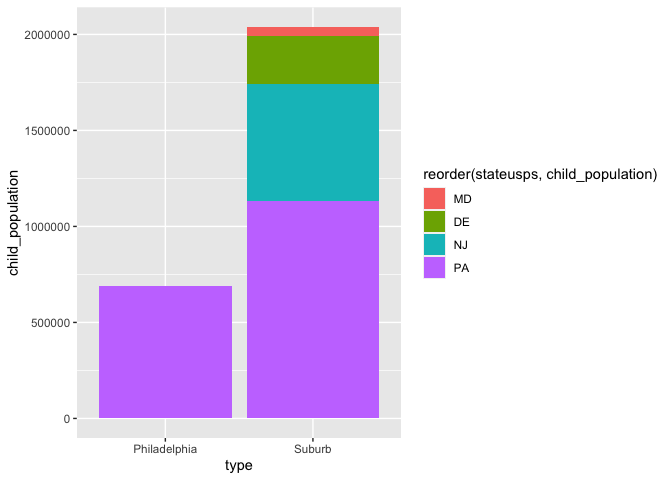<!-- -->

``` r
philly %>% 
  group_by(stateusps, countyfips) %>% 
  summarize(child_population = sum(pop_under_18)) %>% 
  ggplot(aes(x = reorder(stateusps, child_population), y = child_population, fill = countyfips, label = countyfips)) +
  geom_col() +
  geom_text(size = 3, position = position_stack(vjust = 0.5))
```

    ## `summarise()` regrouping output by 'stateusps' (override with `.groups` argument)

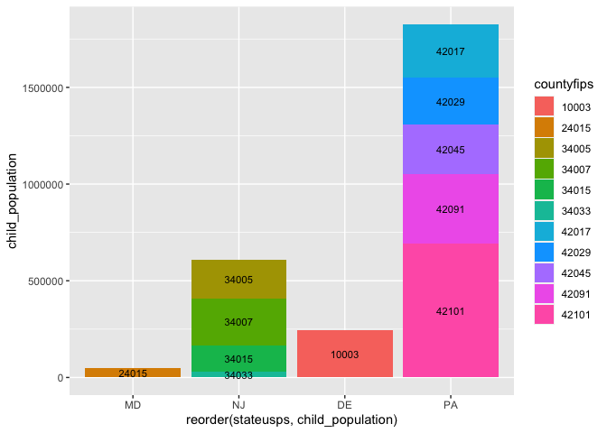<!-- -->

``` r
philly %>% group_by(countyfips, stateusps) %>% 
  summarize(child_population = sum(pop_under_18)) %>% 
  ggplot() +
  geom_col(aes(x = reorder(countyfips, child_population), y = child_population, fill = stateusps)) 
```

    ## `summarise()` regrouping output by 'countyfips' (override with `.groups` argument)

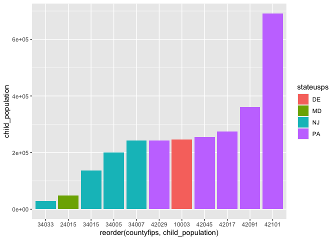<!-- -->

``` r
ggplot(philly, aes(x = type, y = home_ownership)) +
  geom_violin() +
  geom_point(position = position_jitter(width = 0.4), alpha = .35, aes(color = stateusps))
```

    ## Warning: Removed 30 rows containing non-finite values (stat_ydensity).

    ## Warning: Removed 30 rows containing missing values (geom_point).

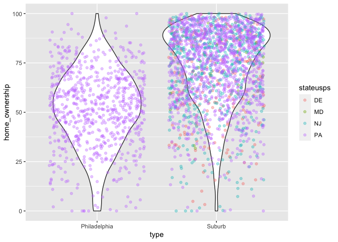<!-- -->

``` r
ggplot(philly, aes(x = stateusps, y = home_ownership)) +
  geom_violin() +
  geom_point(position = position_jitter(width = 0.4), alpha = .35, aes(color = type)) +
  geom_hline(yintercept = 77.06333, colour = "magenta", linetype = "longdash", size = .4)
```

    ## Warning: Removed 30 rows containing non-finite values (stat_ydensity).
    
    ## Warning: Removed 30 rows containing missing values (geom_point).

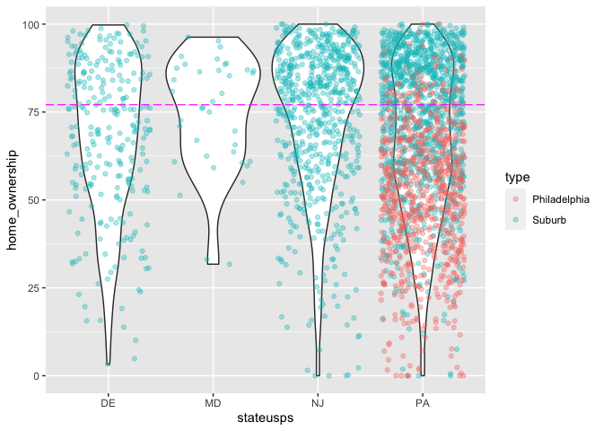<!-- -->

``` r
a <- philly %>% filter(type == 'Suburb') %>% na.omit()

ggplot(philly, aes(x = countyfips, y = home_ownership)) +
  geom_violin() +
  geom_point(position = position_jitter(width = 0.4), alpha = .35, aes(color = stateusps, shape = type)) 
```

    ## Warning: Removed 30 rows containing non-finite values (stat_ydensity).
    
    ## Warning: Removed 30 rows containing missing values (geom_point).

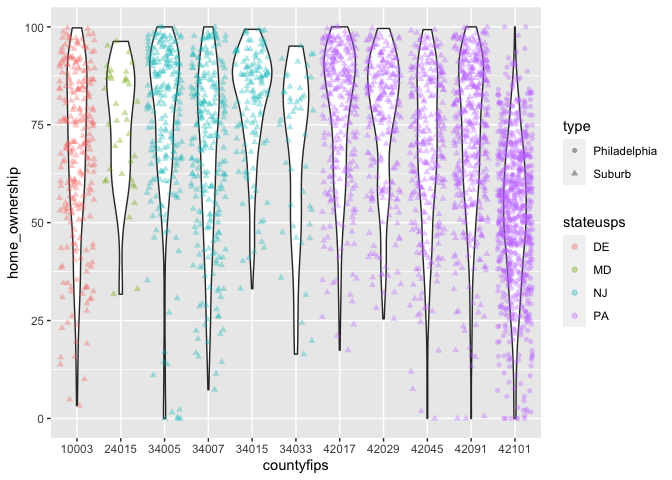<!-- -->

``` r
ggplot(philly, aes(x = countyfips, y = home_ownership)) +
  geom_violin() +
  geom_point(position = position_jitter(width = 0.4), alpha = .35, aes(color = stateusps)) +
  facet_wrap(~year, nrow = 2)
```

    ## Warning: Removed 30 rows containing non-finite values (stat_ydensity).
    
    ## Warning: Removed 30 rows containing missing values (geom_point).

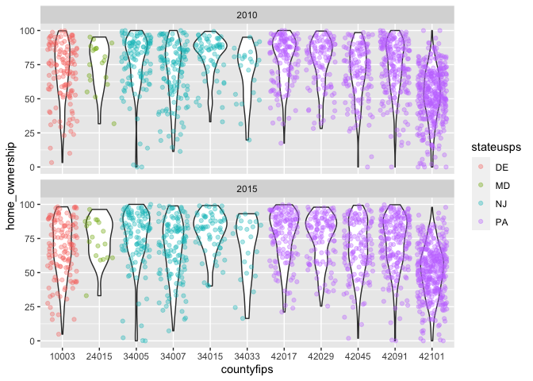<!-- -->

``` r
ggplot(philly, aes(x = highskill_employee, y = home_ownership)) +
  geom_point(aes(col = type))
```

    ## Warning: Removed 31 rows containing missing values (geom_point).

<!-- -->

``` r
ggplot(philly, aes(x = median_income, y = home_ownership)) +
  geom_point(aes(col = type))
```

    ## Warning: Removed 32 rows containing missing values (geom_point).

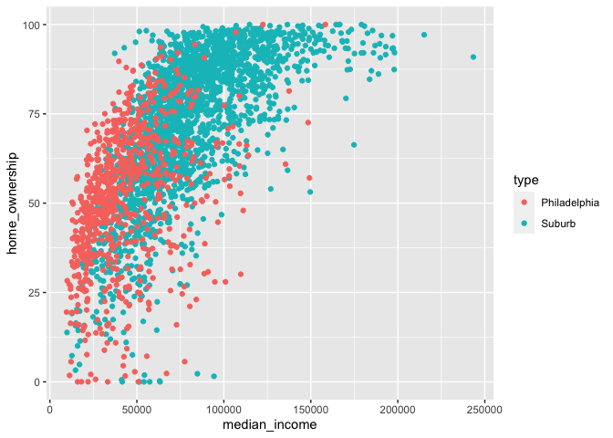<!-- -->

``` r
ggplot(philly, aes(x = type, y = home_ownership)) +
  geom_jitter(alpha=.4)
```

    ## Warning: Removed 30 rows containing missing values (geom_point).

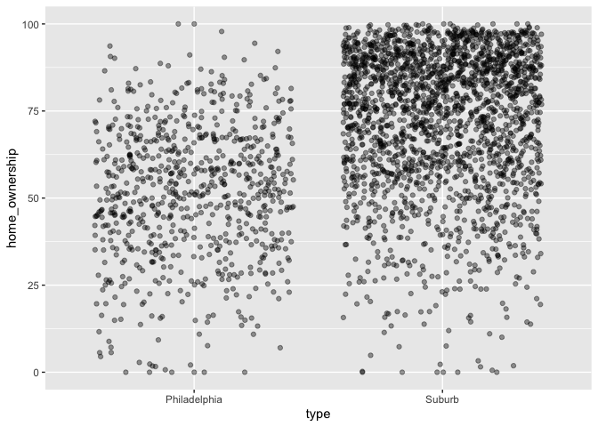<!-- -->

``` r
ggplot(philly, aes(x = type, y = median_income)) +
  geom_jitter(alpha=.4, aes(col = stateusps))
```

    ## Warning: Removed 32 rows containing missing values (geom_point).

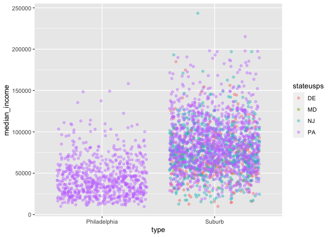<!-- -->

``` r
ggplot(philly, aes(x = type, y =commute_duration)) +
  geom_jitter(alpha=.4, aes(col = stateusps)) +
  ylim(0,35)
```

    ## Warning: Removed 36 rows containing missing values (geom_point).

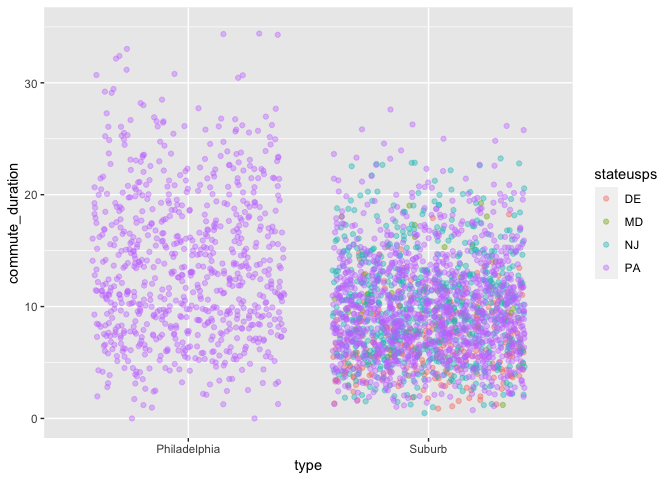<!-- -->
