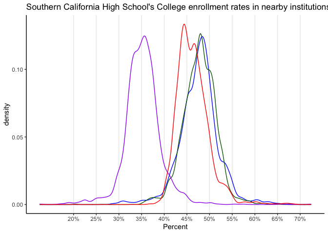

For Meeting on Nov 20
================
Jay Kim

``` r
library(tidyverse)
```

    ## ── Attaching packages ─────────────────────────────────────── tidyverse 1.3.0 ──

    ## ✓ ggplot2 3.3.2     ✓ purrr   0.3.4
    ## ✓ tibble  3.0.4     ✓ dplyr   1.0.2
    ## ✓ tidyr   1.1.2     ✓ stringr 1.4.0
    ## ✓ readr   1.3.1     ✓ forcats 0.5.0

    ## ── Conflicts ────────────────────────────────────────── tidyverse_conflicts() ──
    ## x dplyr::filter() masks stats::filter()
    ## x dplyr::lag()    masks stats::lag()

``` r
library(ggplot2)
library(readr)
library(ggalt)
```

    ## Registered S3 methods overwritten by 'ggalt':
    ##   method                  from   
    ##   grid.draw.absoluteGrob  ggplot2
    ##   grobHeight.absoluteGrob ggplot2
    ##   grobWidth.absoluteGrob  ggplot2
    ##   grobX.absoluteGrob      ggplot2
    ##   grobY.absoluteGrob      ggplot2

``` r
data <- read_csv("/Users/jaykim/Documents/EDA/eda20-team5-project/Jay's work/data.csv")
```

    ## Parsed with column specification:
    ## cols(
    ##   .default = col_double(),
    ##   geoid = col_character(),
    ##   msaname15 = col_character(),
    ##   countyfips = col_character(),
    ##   statefips = col_character(),
    ##   stateusps = col_character()
    ## )

    ## See spec(...) for full column specifications.

``` r
head(data)
```

    ## # A tibble: 6 x 39
    ##   `_id` geoid  year in100 msaid15 msaname15 countyfips statefips stateusps   pop
    ##   <dbl> <chr> <dbl> <dbl>   <dbl> <chr>     <chr>      <chr>     <chr>     <dbl>
    ## 1     1 0100…  2010     0   33860 Montgome… 01001      01        AL          424
    ## 2     2 0100…  2015     0   33860 Montgome… 01001      01        AL          414
    ## 3     3 0100…  2010     0   33860 Montgome… 01001      01        AL          497
    ## 4     4 0100…  2015     0   33860 Montgome… 01001      01        AL          508
    ## 5     5 0100…  2010     0   33860 Montgome… 01001      01        AL          878
    ## 6     6 0100…  2015     0   33860 Montgome… 01001      01        AL          804
    ## # … with 29 more variables: ED_APENR <dbl>, ED_ATTAIN <dbl>, ED_COLLEGE <dbl>,
    ## #   ED_ECENROL <dbl>, ED_HSGRAD <dbl>, ED_MATH <dbl>, ED_READING <dbl>,
    ## #   ED_SCHPOV <dbl>, ED_TEACHXP <dbl>, ED_PRXECE <dbl>, ED_PRXHQECE <dbl>,
    ## #   HE_FOOD <dbl>, HE_GREEN <dbl>, HE_HEAT <dbl>, HE_HLTHINS <dbl>,
    ## #   HE_OZONE <dbl>, HE_PM25 <dbl>, HE_VACANCY <dbl>, HE_WALK <dbl>,
    ## #   HE_SUPRFND <dbl>, HE_RSEI <dbl>, SE_POVRATE <dbl>, SE_PUBLIC <dbl>,
    ## #   SE_HOME <dbl>, SE_OCC <dbl>, SE_MHE <dbl>, SE_EMPRAT <dbl>,
    ## #   SE_JOBPROX <dbl>, SE_SINGLE <dbl>

# Analysis 1: College enrollment in nearby institutions

Percentage 18-24 year-olds enrolled in college within 25-mile radius.

LOS ANGELES

``` r
#4 diff datasets each for 4 diff regions
college_enrolled_NYC <- data%>%
  filter(msaname15 == "New York-Newark-Jersey City, NY-NJ-PA Metro Area")

college_enrolled_LA <- data%>%
  filter(msaname15 == "Los Angeles-Long Beach-Anaheim, CA Metro Area")

college_enrolled_Hou <- data%>%
  filter(msaname15 == "Houston-The Woodlands-Sugar Land, TX Metro Area")

college_enrolled_Philly <- data%>%
  filter(msaname15 == "Philadelphia-Camden-Wilmington, PA-NJ-DE-MD Metro Area")
```

``` r
ggplot() +
  geom_density(aes(ED_COLLEGE), alpha = .2, col="blue", data = college_enrolled_NYC) +
  geom_density(aes(ED_COLLEGE),  alpha = .2, col="darkgreen",  data = college_enrolled_LA)+
  geom_density(aes(ED_COLLEGE),  alpha = .2, col="purple",  data = college_enrolled_Hou)+
  geom_density(aes(ED_COLLEGE),  alpha = .2,  col="red", data = college_enrolled_Philly)+
    theme_classic()+ 
  theme(panel.grid.major.x=element_line())+ #add grid lines
  scale_x_continuous(
            breaks=seq(20, 70, 5),
            labels = function(x){paste0(x*1, "%")}
            )+ #change x axis labels+
  labs(title = "Southern California High School's College enrollment rates in nearby institutions",
       x="Percent"
       )
```

    ## Warning: Removed 6728 rows containing non-finite values (stat_density).

<!-- -->

# Analysis 2: see how HS grad rates changed from 2010 to 2015

Los Angeles - Los Angeles-Long Beach-Anaheim, CA Metro Area -
Riverside-San Bernardino-Ontario, CA Metro Area  
\- San Diego-Carlsbad, CA Metro Area - Oxnard-Thousand Oaks-Ventura, CA
Metro Area

New York

``` r
head(data)
```

    ## # A tibble: 6 x 39
    ##   `_id` geoid  year in100 msaid15 msaname15 countyfips statefips stateusps   pop
    ##   <dbl> <chr> <dbl> <dbl>   <dbl> <chr>     <chr>      <chr>     <chr>     <dbl>
    ## 1     1 0100…  2010     0   33860 Montgome… 01001      01        AL          424
    ## 2     2 0100…  2015     0   33860 Montgome… 01001      01        AL          414
    ## 3     3 0100…  2010     0   33860 Montgome… 01001      01        AL          497
    ## 4     4 0100…  2015     0   33860 Montgome… 01001      01        AL          508
    ## 5     5 0100…  2010     0   33860 Montgome… 01001      01        AL          878
    ## 6     6 0100…  2015     0   33860 Montgome… 01001      01        AL          804
    ## # … with 29 more variables: ED_APENR <dbl>, ED_ATTAIN <dbl>, ED_COLLEGE <dbl>,
    ## #   ED_ECENROL <dbl>, ED_HSGRAD <dbl>, ED_MATH <dbl>, ED_READING <dbl>,
    ## #   ED_SCHPOV <dbl>, ED_TEACHXP <dbl>, ED_PRXECE <dbl>, ED_PRXHQECE <dbl>,
    ## #   HE_FOOD <dbl>, HE_GREEN <dbl>, HE_HEAT <dbl>, HE_HLTHINS <dbl>,
    ## #   HE_OZONE <dbl>, HE_PM25 <dbl>, HE_VACANCY <dbl>, HE_WALK <dbl>,
    ## #   HE_SUPRFND <dbl>, HE_RSEI <dbl>, SE_POVRATE <dbl>, SE_PUBLIC <dbl>,
    ## #   SE_HOME <dbl>, SE_OCC <dbl>, SE_MHE <dbl>, SE_EMPRAT <dbl>,
    ## #   SE_JOBPROX <dbl>, SE_SINGLE <dbl>

``` r
NYC <- data %>%
  filter(stateusps == "NY")%>%
  group_by(msaname15)%>%
  summarise(count=n())%>%
  arrange(desc(count))
```

    ## `summarise()` ungrouping output (override with `.groups` argument)

``` r
NYC
```

    ## # A tibble: 27 x 2
    ##    msaname15                                        count
    ##    <chr>                                            <int>
    ##  1 New York-Newark-Jersey City, NY-NJ-PA Metro Area  6478
    ##  2 Buffalo-Cheektowaga-Niagara Falls, NY Metro Area   598
    ##  3 Rochester, NY Metro Area                           544
    ##  4 Albany-Schenectady-Troy, NY Metro Area             436
    ##  5 Syracuse, NY Metro Area                            372
    ##  6 <NA>                                               236
    ##  7 Utica-Rome, NY Metro Area                          186
    ##  8 Binghamton, NY Metro Area                          130
    ##  9 Kingston, NY Metro Area                             94
    ## 10 Glens Falls, NY Metro Area                          72
    ## # … with 17 more rows

Houston

``` r
head(data)
```

    ## # A tibble: 6 x 39
    ##   `_id` geoid  year in100 msaid15 msaname15 countyfips statefips stateusps   pop
    ##   <dbl> <chr> <dbl> <dbl>   <dbl> <chr>     <chr>      <chr>     <chr>     <dbl>
    ## 1     1 0100…  2010     0   33860 Montgome… 01001      01        AL          424
    ## 2     2 0100…  2015     0   33860 Montgome… 01001      01        AL          414
    ## 3     3 0100…  2010     0   33860 Montgome… 01001      01        AL          497
    ## 4     4 0100…  2015     0   33860 Montgome… 01001      01        AL          508
    ## 5     5 0100…  2010     0   33860 Montgome… 01001      01        AL          878
    ## 6     6 0100…  2015     0   33860 Montgome… 01001      01        AL          804
    ## # … with 29 more variables: ED_APENR <dbl>, ED_ATTAIN <dbl>, ED_COLLEGE <dbl>,
    ## #   ED_ECENROL <dbl>, ED_HSGRAD <dbl>, ED_MATH <dbl>, ED_READING <dbl>,
    ## #   ED_SCHPOV <dbl>, ED_TEACHXP <dbl>, ED_PRXECE <dbl>, ED_PRXHQECE <dbl>,
    ## #   HE_FOOD <dbl>, HE_GREEN <dbl>, HE_HEAT <dbl>, HE_HLTHINS <dbl>,
    ## #   HE_OZONE <dbl>, HE_PM25 <dbl>, HE_VACANCY <dbl>, HE_WALK <dbl>,
    ## #   HE_SUPRFND <dbl>, HE_RSEI <dbl>, SE_POVRATE <dbl>, SE_PUBLIC <dbl>,
    ## #   SE_HOME <dbl>, SE_OCC <dbl>, SE_MHE <dbl>, SE_EMPRAT <dbl>,
    ## #   SE_JOBPROX <dbl>, SE_SINGLE <dbl>

``` r
TX <- data %>%
  filter(stateusps == "TX")%>%
  group_by(msaname15)%>%
  summarise(count=n())%>%
  arrange(desc(count))
```

    ## `summarise()` ungrouping output (override with `.groups` argument)

``` r
TX
```

    ## # A tibble: 70 x 2
    ##    msaname15                                       count
    ##    <chr>                                           <int>
    ##  1 Dallas-Fort Worth-Arlington, TX Metro Area       2648
    ##  2 Houston-The Woodlands-Sugar Land, TX Metro Area  2144
    ##  3 San Antonio-New Braunfels, TX Metro Area          914
    ##  4 <NA>                                              762
    ##  5 Austin-Round Rock, TX Metro Area                  700
    ##  6 El Paso, TX Metro Area                            324
    ##  7 McAllen-Edinburg-Mission, TX Metro Area           226
    ##  8 Beaumont-Port Arthur, TX Metro Area               218
    ##  9 Corpus Christi, TX Metro Area                     208
    ## 10 Killeen-Temple, TX Metro Area                     178
    ## # … with 60 more rows

Philadelphia

``` r
head(data)
```

    ## # A tibble: 6 x 39
    ##   `_id` geoid  year in100 msaid15 msaname15 countyfips statefips stateusps   pop
    ##   <dbl> <chr> <dbl> <dbl>   <dbl> <chr>     <chr>      <chr>     <chr>     <dbl>
    ## 1     1 0100…  2010     0   33860 Montgome… 01001      01        AL          424
    ## 2     2 0100…  2015     0   33860 Montgome… 01001      01        AL          414
    ## 3     3 0100…  2010     0   33860 Montgome… 01001      01        AL          497
    ## 4     4 0100…  2015     0   33860 Montgome… 01001      01        AL          508
    ## 5     5 0100…  2010     0   33860 Montgome… 01001      01        AL          878
    ## 6     6 0100…  2015     0   33860 Montgome… 01001      01        AL          804
    ## # … with 29 more variables: ED_APENR <dbl>, ED_ATTAIN <dbl>, ED_COLLEGE <dbl>,
    ## #   ED_ECENROL <dbl>, ED_HSGRAD <dbl>, ED_MATH <dbl>, ED_READING <dbl>,
    ## #   ED_SCHPOV <dbl>, ED_TEACHXP <dbl>, ED_PRXECE <dbl>, ED_PRXHQECE <dbl>,
    ## #   HE_FOOD <dbl>, HE_GREEN <dbl>, HE_HEAT <dbl>, HE_HLTHINS <dbl>,
    ## #   HE_OZONE <dbl>, HE_PM25 <dbl>, HE_VACANCY <dbl>, HE_WALK <dbl>,
    ## #   HE_SUPRFND <dbl>, HE_RSEI <dbl>, SE_POVRATE <dbl>, SE_PUBLIC <dbl>,
    ## #   SE_HOME <dbl>, SE_OCC <dbl>, SE_MHE <dbl>, SE_EMPRAT <dbl>,
    ## #   SE_JOBPROX <dbl>, SE_SINGLE <dbl>

``` r
PA <- data %>%
  filter(stateusps == "PA")%>%
  group_by(msaname15)%>%
  summarise(count=n())%>%
  arrange(desc(count))
```

    ## `summarise()` ungrouping output (override with `.groups` argument)

``` r
PA
```

    ## # A tibble: 38 x 2
    ##    msaname15                                              count
    ##    <chr>                                                  <int>
    ##  1 Philadelphia-Camden-Wilmington, PA-NJ-DE-MD Metro Area  1996
    ##  2 Pittsburgh, PA Metro Area                               1422
    ##  3 Scranton--Wilkes-Barre--Hazleton, PA Metro Area          340
    ##  4 Allentown-Bethlehem-Easton, PA-NJ Metro Area             312
    ##  5 Harrisburg-Carlisle, PA Metro Area                       248
    ##  6 Lancaster, PA Metro Area                                 196
    ##  7 <NA>                                                     196
    ##  8 Reading, PA Metro Area                                   180
    ##  9 York-Hanover, PA Metro Area                              180
    ## 10 Erie, PA Metro Area                                      144
    ## # … with 28 more rows

data manip:

``` r
data5 <-data %>% 
  drop_na(ED_HSGRAD) #getting rid of NA values

#average grad rates in 2015
grad_rates_15<- data5%>%
  filter(msaname15 %in% c("Riverside-San Bernardino-Ontario, CA Metro Area", "San Diego-Carlsbad, CA Metro Area","Oxnard-Thousand Oaks-Ventura, CA Metro Area","Los Angeles-Long Beach-Anaheim, CA Metro Area" ,"Philadelphia-Camden-Wilmington, PA-NJ-DE-MD Metro Area", "Pittsburgh, PA Metro Area","Scranton--Wilkes-Barre--Hazleton, PA Metro Area","Houston-The Woodlands-Sugar Land, TX Metro Area    ","New York-Newark-Jersey City, NY-NJ-PA Metro Area "))%>%
  filter(year == '2015')%>%
  group_by(msaname15, year)%>%
  summarise(mean_grad_2015 = mean(ED_HSGRAD))%>%
  mutate(region = sapply(strsplit(msaname15, ","),"[", 1))
```

    ## `summarise()` regrouping output by 'msaname15' (override with `.groups` argument)

``` r
#grad_rates_15

 
#average grad rates in 2010
grad_rates_10<- data5%>%
  filter(msaname15 %in% c("Riverside-San Bernardino-Ontario, CA Metro Area", "San Diego-Carlsbad, CA Metro Area","Oxnard-Thousand Oaks-Ventura, CA Metro Area","Los Angeles-Long Beach-Anaheim, CA Metro Area" ,"Philadelphia-Camden-Wilmington, PA-NJ-DE-MD Metro Area", "Pittsburgh, PA Metro Area","Scranton--Wilkes-Barre--Hazleton, PA Metro Area","Houston-The Woodlands-Sugar Land, TX Metro Area    ","New York-Newark-Jersey City, NY-NJ-PA Metro Area "))%>%
  filter(year == '2010')%>%
  group_by(msaname15, year)%>%
  summarise(mean_grad_2010 = mean(ED_HSGRAD))%>%
  mutate(region = sapply(strsplit(msaname15, ","),"[", 1))
```

    ## `summarise()` regrouping output by 'msaname15' (override with `.groups` argument)

``` r
#grad_rates_10

#Join on msaname15
grad_rate<- inner_join(grad_rates_10,grad_rates_15, by= "region")%>%
  select(region, year.x, year.y, mean_grad_2010, mean_grad_2015) #selecting relevant columns
#grad_rate 
```

plot:

``` r
ggplot(grad_rate, aes(y=region, x = mean_grad_2015, xend = mean_grad_2010)) + 
        geom_dumbbell(color= "olivedrab", 
                      size=0.75, 
                      point.colour.l="black") +
  labs(title = "Change in high school graduation rate", 
       x = "Percent Graduated",
       y = "Region")+
  theme_classic()+
  theme(panel.grid.major.x=element_line())+
   scale_x_continuous(
            breaks=seq(76, 100, 1),
            labels = function(x){paste0(x*1, '%')}
            )
```

    ## Warning: Ignoring unknown parameters: point.colour.l

<!-- -->

``` r
#or
#   scale_x_continuous(
#            breaks=seq(76, 82, 0.5),
#            labels = function(x){paste0(x*1, '%')}
#            )
  
#how to indicate which change is positive vs negative
#ifelse(mean_grad_2015 > mean_grad_2010, "red", "blue" : not working
#idk how to drop "Metro Area"
#how to add percent symbols 
```

# Analysis 3: AP Classes x Single-Headed Households

Data manipulation:

LA

``` r
data1 <-data %>% 
  drop_na(ED_APENR,SE_SINGLE) #getting rid of NA values
#ED_APENR : Ratio of students enrolled in at least one AP course to the number of 11th and 12th graders.

LA <- data1%>%
  filter(msaname15 =="Los Angeles-Long Beach-Anaheim, CA Metro Area")%>% #looking at only LA
  group_by(geoid)%>%  #group by cities/counties in CA
  summarise(avg_AP= mean(ED_APENR), avg_single = mean(SE_SINGLE))%>% 
  #column called "avg_AP" that is avg % of students in AP
  #column called "avg_single" that is average % of single headed households
  arrange(desc(avg_AP))
```

    ## `summarise()` ungrouping output (override with `.groups` argument)

``` r
#LA 

#compare 'CA' with % of AP enrolled after u take out cities that have % of single-headed household >30
LA_less_single <- LA%>%
  filter(avg_single<15)%>%
  arrange(desc(avg_single))
#LA_less_single
```

Houston

``` r
data1 <-data %>% 
  drop_na(ED_APENR, SE_SINGLE) #getting rid of NA values
#ED_APENR : Ratio of students enrolled in at least one AP course to the number of 11th and 12th graders.

Hou <- data1%>%
  filter(msaname15 =="Houston-The Woodlands-Sugar Land, TX Metro Area")%>% #looking at only Houston
  group_by(geoid)%>%  #group by cities/counties in CA
  summarise(avg_AP= mean(ED_APENR), avg_single = mean(SE_SINGLE))%>% 
  #column called "avg_AP" that is avg % of students in AP
  #column called "avg_single" that is average % of single headed households
  arrange(desc(avg_AP))
```

    ## `summarise()` ungrouping output (override with `.groups` argument)

``` r
#Hou 

#compare 'Hou' with % of AP enrolled after u take out cities that have % of single-headed household >30
Hou_less_single <- Hou%>%
  filter(avg_single<15)%>%
  arrange(desc(avg_single))
#Hou_less_single
```

NYC

``` r
data1 <-data %>% 
  drop_na(ED_APENR,SE_SINGLE) #getting rid of NA values
#ED_APENR : Ratio of students enrolled in at least one AP course to the number of 11th and 12th graders.

NYC <- data1%>%
  filter(msaname15 =="New York-Newark-Jersey City, NY-NJ-PA Metro Area")%>% #looking at only NYC
  group_by(geoid)%>%  #group by cities/counties in CA
  summarise(avg_AP= mean(ED_APENR), avg_single = mean(SE_SINGLE))%>% 
  #column called "avg_AP" that is avg % of students in AP
  #column called "avg_single" that is average % of single headed households
  arrange(desc(avg_AP))
```

    ## `summarise()` ungrouping output (override with `.groups` argument)

``` r
#NYC 

#compare 'NY' with % of AP enrolled after u take out cities that have % of single-headed household >30
NYC_less_single <- NYC%>%
  filter(avg_single<15)%>%
  arrange(desc(avg_single))
#NYC_less_single
```

Philly

``` r
data1 <-data %>% 
  drop_na(ED_APENR, SE_SINGLE) #getting rid of NA values
#ED_APENR : Ratio of students enrolled in at least one AP course to the number of 11th and 12th graders.

Philly <- data1%>%
  filter(msaname15 =="Philadelphia-Camden-Wilmington, PA-NJ-DE-MD Metro Area")%>% #looking at only Houston
  group_by(geoid)%>%  #group by cities/counties in CA
  summarise(avg_AP= mean(ED_APENR), avg_single = mean(SE_SINGLE))%>% 
  #column called "avg_AP" that is avg % of students in AP
  #column called "avg_single" that is average % of single headed households
  arrange(desc(avg_AP))
```

    ## `summarise()` ungrouping output (override with `.groups` argument)

``` r
#Philly 

#compare 'Hou' with % of AP enrolled after u take out cities that have % of single-headed household >30
Philly_less_single <- Philly%>%
  filter(avg_single<15)%>%
  arrange(desc(avg_single))
#Philly_less_single
```

Plots:

``` r
LA_AP<- ggplot()+
  geom_density(aes(avg_AP), alpha = .2, fill="pink", data = LA)+
  geom_density(aes(avg_AP), alpha = .2, fill="lightblue",  data = LA_less_single)+
  labs(
    title="Ratio of students enrolled in at least one AP course to the number of 11th and 12th graders.",
    subtitle="Los Angeles",
    x="% in AP courses",
    y="Frequency"
  )+
  theme_classic()+
  theme(panel.grid.major.x=element_line())
LA_AP
```

<!-- -->

``` r
NYC_AP <- ggplot()+
  geom_density(aes(avg_AP), alpha = .2, fill="pink", data = NYC)+
  geom_density(aes(avg_AP), alpha = .2, fill="lightblue",  data = NYC_less_single)+
  labs(
    title="Ratio of students enrolled in at least one AP course to the number of 11th and 12th graders.",
    subtitle="New York, Newark, Jersey City",
    x="% in AP courses",
    y="Frequency"
  )+
  theme_classic()+
  theme(panel.grid.major.x=element_line())
NYC_AP
```

<!-- -->

``` r
Hou_AP <- ggplot()+
  geom_density(aes(avg_AP), alpha = .2, fill="pink", data = Hou)+
  geom_density(aes(avg_AP), alpha = .2, fill="lightblue",  data = Hou_less_single)+
  labs(
    title="Ratio of students enrolled in at least one AP course to the number of 11th and 12th graders.",
    subtitle="Houston",
    x="% in AP courses",
    y="Frequency"
  )+
  theme_classic()+
  theme(panel.grid.major.x=element_line())
Hou_AP
```

<!-- -->

``` r
Philly_AP <- ggplot()+
  geom_density(aes(avg_AP), alpha = .2, fill="pink", data = Philly)+
  geom_density(aes(avg_AP), alpha = .2, fill="lightblue",  data = Philly_less_single)+
  labs(
    title="Ratio of students enrolled in at least one AP course to the number of 11th and 12th graders.",
    subtitle="Philadelphia-Camden-Wilmington",
    x="% in AP courses",
    y="Frequency"
  )+
  theme_classic()+
  theme(panel.grid.major.x=element_line())
Philly_AP
```

<!-- -->

In the US, the two most common ways of measuring academic abilities
include GPA and Standardized Test Scores. While we did not have those
variables to analyze, we did have the ratio of 11th/12th grades enrolled
in at least 1 AP class to the total number of students at that high
school. To make the best out of the data we were presented, we decided
to analyze how home life affects a high school student’s ambition in the
classroom. Across all four major cities, we see a general trend that
more students at schools where less than 15% of the student’s families
are single-headed enrolled in at least 1 AP class. Another home-life
factor there was to analyze was median household income.

# Analysis 4: AP Classes x Median household income

Data manipulation:

LA

``` r
data1 <-data %>% 
  drop_na(ED_APENR,SE_MHE) #getting rid of NA values
#ED_APENR : Ratio of students enrolled in at least one AP course to the number of 11th and 12th graders.

LA <- data1%>%
  filter(msaname15 =="Los Angeles-Long Beach-Anaheim, CA Metro Area")%>% #looking at only LA
  group_by(geoid)%>%  #group by cities/counties in CA
  summarise(avg_AP= mean(ED_APENR), mean_inc = mean(SE_MHE))%>% 
  #column called "avg_AP" that is avg % of students in AP
  #column called "avg_median" that is median income
  arrange(desc(avg_AP))
```

    ## `summarise()` ungrouping output (override with `.groups` argument)

``` r
#LA 

#compare 'CA' with % of AP enrolled after u take out cities that have % of single-headed household >30
LA_wealthy <- LA%>%
  filter(mean_inc>90000)%>%
  arrange(desc(mean_inc))
#LA_wealthy
```

Houston

``` r
data1 <-data %>% 
  drop_na(ED_APENR, SE_MHE) #getting rid of NA values
#ED_APENR : Ratio of students enrolled in at least one AP course to the number of 11th and 12th graders.

Hou <- data1%>%
  filter(msaname15 =="Houston-The Woodlands-Sugar Land, TX Metro Area")%>% #looking at only Houston
  group_by(geoid)%>%  #group by cities/counties in CA
  summarise(avg_AP= mean(ED_APENR), mean_inc = mean(SE_MHE))%>% 
  #column called "avg_AP" that is avg % of students in AP
   #column called "avg_median" that is median income
  arrange(desc(avg_AP))
```

    ## `summarise()` ungrouping output (override with `.groups` argument)

``` r
#Hou 

#compare 'Hou' with % of AP enrolled after u take out cities that have % of single-headed household >30
Hou_wealthy <- Hou%>%
  filter(mean_inc>90000)%>%
  arrange(desc(mean_inc))
#Hou_wealthy
```

NYC

``` r
data1 <-data %>% 
  drop_na(ED_APENR,SE_MHE) #getting rid of NA values
#ED_APENR : Ratio of students enrolled in at least one AP course to the number of 11th and 12th graders.

NYC <- data1%>%
  filter(msaname15 =="New York-Newark-Jersey City, NY-NJ-PA Metro Area")%>% #looking at only NYC
  group_by(geoid)%>%  #group by cities/counties in CA
  summarise(avg_AP= mean(ED_APENR), mean_inc = mean(SE_MHE))%>% 
  #column called "avg_AP" that is avg % of students in AP
   #column called "avg_median" that is median income
  arrange(desc(avg_AP))
```

    ## `summarise()` ungrouping output (override with `.groups` argument)

``` r
#NYC 

#compare 'NY' with % of AP enrolled after u take out cities that have % of single-headed household >30
NYC_wealthy <- NYC%>%
  filter(mean_inc>90000)%>%
  arrange(desc(mean_inc))
#NYC_wealthy
```

Philly

``` r
data1 <-data %>% 
  drop_na(ED_APENR, SE_MHE) #getting rid of NA values
#ED_APENR : Ratio of students enrolled in at least one AP course to the number of 11th and 12th graders.

Philly <- data1%>%
  filter(msaname15 =="Philadelphia-Camden-Wilmington, PA-NJ-DE-MD Metro Area")%>% #looking at only Houston
  group_by(geoid)%>%  #group by cities/counties in CA
  summarise(avg_AP= mean(ED_APENR), mean_inc = mean(SE_MHE))%>% 
  #column called "avg_AP" that is avg % of students in AP
   #column called "avg_median" that is median income
  arrange(desc(avg_AP))
```

    ## `summarise()` ungrouping output (override with `.groups` argument)

``` r
#Philly 

#compare 'Hou' with % of AP enrolled after u take out cities that have % of single-headed household >30
Philly_wealthy <- Philly%>%
  filter(mean_inc>90000)%>%
  arrange(desc(mean_inc))
#Philly_wealthy
```

Plots:

``` r
LA_AP<- ggplot()+
  geom_density(aes(avg_AP), alpha = .2, fill="pink", data = LA)+
  geom_density(aes(avg_AP), alpha = .2, fill="lightblue",  data = LA_wealthy)+
  labs(
    title="Ratio of students enrolled in at least one AP course to the number of 11th and 12th graders.",
    subtitle="Los Angeles",
    x="% in AP courses",
    y="Frequency"
  )+
  theme_classic()+
  theme(panel.grid.major.x=element_line())
LA_AP
```

<!-- -->

``` r
NYC_AP <- ggplot()+
  geom_density(aes(avg_AP), alpha = .2, fill="pink", data = NYC)+
  geom_density(aes(avg_AP), alpha = .2, fill="lightblue",  data = NYC_wealthy)+
  labs(
    title="Ratio of students enrolled in at least one AP course to the number of 11th and 12th graders.",
    subtitle="New York, Newark, Jersey City",
    x="% in AP courses",
    y="Frequency"
  )+
  theme_classic()+
  theme(panel.grid.major.x=element_line())
NYC_AP
```

<!-- -->

``` r
Hou_AP <- ggplot()+
  geom_density(aes(avg_AP), alpha = .2, fill="pink", data = Hou)+
  geom_density(aes(avg_AP), alpha = .2, fill="lightblue",  data = Hou_wealthy)+
  labs(
    title="Ratio of students enrolled in at least one AP course to the number of 11th and 12th graders.",
    subtitle="Houston",
    x="% in AP courses",
    y="Frequency"
  )+
  theme_classic()+
  theme(panel.grid.major.x=element_line())
Hou_AP
```

<!-- -->

``` r
Philly_ap <- ggplot()+
  geom_density(aes(avg_AP), alpha = .2, fill="pink", data = Philly)+
  geom_density(aes(avg_AP), alpha = .2, fill="lightblue",  data = Philly_wealthy)+
  labs(
    title="Ratio of students enrolled in at least one AP course to the number of 11th and 12th graders.",
    subtitle="Philadelphia-Camden-Wilmington",
    x="% in AP courses",
    y="Frequency"
  )+
  theme_classic()+
  theme(panel.grid.major.x=element_line())
  
Philly_ap
```

<!-- -->

From what we saw from analysis 4, we should not be too surprised that
students from households who earn an income of at least 90K tend to be
more ambitious in the classroom. This could be due to a number of
factors. Students of lower incomes have a higher chance of having more
responsibilities at home, such as taking care of younger siblings or
working a part-time job.

# Analysis 5: How each city compares in median income

data manip:

``` r
A <- data%>%
  drop_na(SE_MHE)

main_four <- A %>%
  filter (msaname15 %in% c("Los Angeles-Long Beach-Anaheim, CA Metro Area" ,"Philadelphia-Camden-Wilmington, PA-NJ-DE-MD Metro Area","Houston-The Woodlands-Sugar Land, TX Metro Area", "New York-Newark-Jersey City, NY-NJ-PA Metro Area" ))%>%
  group_by(msaname15)%>%
  summarise(mean_inc = mean(SE_MHE))%>%
  mutate(deviation= mean_inc - 71220.56)%>%
  mutate(region = sapply(strsplit(msaname15, "-"),"[", 1))%>%
  arrange(desc(mean_inc))
```

    ## `summarise()` ungrouping output (override with `.groups` argument)

``` r
main_four%>%
   summarise(mean(mean_inc))
```

    ## # A tibble: 1 x 1
    ##   `mean(mean_inc)`
    ##              <dbl>
    ## 1           71221.

plot

``` r
ggplot(main_four, aes(x = reorder(region, deviation), y = deviation,
           fill = deviation >0))+
  geom_bar(stat = "identity")+
  coord_flip()+
  scale_fill_discrete(name = "", labels = c("Below Average", "Above Average"))+
  labs(
    title="Household income",
    subtitle="We can see how each city is above or below the state average, $71,224",
    x = "City",
    y = "Amount Difference"
  )+
  theme_bw()
```

<!-- -->

``` r
#How do I drop the "CA, Metro Area"
```

This graph is not interesting, just for reference. So all 4 cities make
more than the national average, 60K. This is information tho that we can
pull from the internet, it will be more accurate anyways. We can see if
there exists a correlation between amount of income diff and %change in
ap classes?
