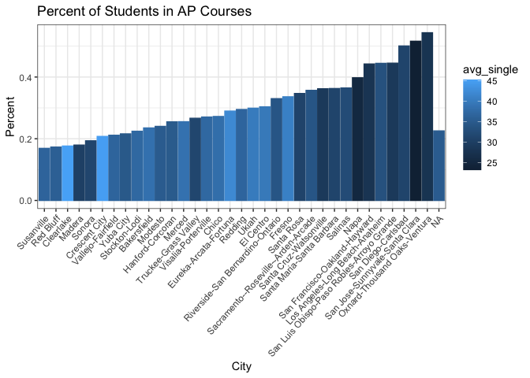
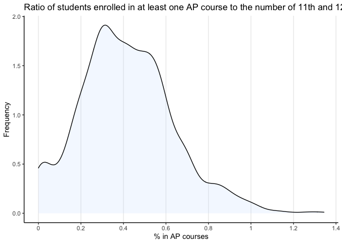
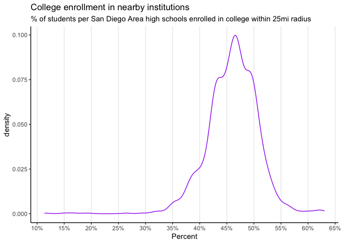

Meeting 17th
================
Jay Kim

# ISSUES I RAN INTO

‘msaname15’ is not county, its cities: can we change our motivating
question to ’How big cities compare to surrounding small CITIES (instead
of counties?)

\#Things I like: - i like how the base of our project is running
comparisions -\> drawing inferences/conclusions. much more interesting
than plotting 10-15 graphs, and then just summarizing what we see from
the plots.

``` r
library(tidyverse)
```

    ## ── Attaching packages ─────────────────────────────────────── tidyverse 1.3.0 ──

    ## ✓ ggplot2 3.3.2     ✓ purrr   0.3.4
    ## ✓ tibble  3.0.4     ✓ dplyr   1.0.2
    ## ✓ tidyr   1.1.2     ✓ stringr 1.4.0
    ## ✓ readr   1.3.1     ✓ forcats 0.5.0

    ## ── Conflicts ────────────────────────────────────────── tidyverse_conflicts() ──
    ## x dplyr::filter() masks stats::filter()
    ## x dplyr::lag()    masks stats::lag()

``` r
library(ggplot2)
library(readr)
library(ggalt)
```

    ## Registered S3 methods overwritten by 'ggalt':
    ##   method                  from   
    ##   grid.draw.absoluteGrob  ggplot2
    ##   grobHeight.absoluteGrob ggplot2
    ##   grobWidth.absoluteGrob  ggplot2
    ##   grobX.absoluteGrob      ggplot2
    ##   grobY.absoluteGrob      ggplot2

``` r
data <- read_csv("/Users/jaykim/Documents/EDA/eda20-team5-project/Jay's work/data.csv")
```

    ## Parsed with column specification:
    ## cols(
    ##   .default = col_double(),
    ##   geoid = col_character(),
    ##   msaname15 = col_character(),
    ##   countyfips = col_character(),
    ##   statefips = col_character(),
    ##   stateusps = col_character()
    ## )

    ## See spec(...) for full column specifications.

``` r
head(data)
```

    ## # A tibble: 6 x 39
    ##   `_id` geoid  year in100 msaid15 msaname15 countyfips statefips stateusps   pop
    ##   <dbl> <chr> <dbl> <dbl>   <dbl> <chr>     <chr>      <chr>     <chr>     <dbl>
    ## 1     1 0100…  2010     0   33860 Montgome… 01001      01        AL          424
    ## 2     2 0100…  2015     0   33860 Montgome… 01001      01        AL          414
    ## 3     3 0100…  2010     0   33860 Montgome… 01001      01        AL          497
    ## 4     4 0100…  2015     0   33860 Montgome… 01001      01        AL          508
    ## 5     5 0100…  2010     0   33860 Montgome… 01001      01        AL          878
    ## 6     6 0100…  2015     0   33860 Montgome… 01001      01        AL          804
    ## # … with 29 more variables: ED_APENR <dbl>, ED_ATTAIN <dbl>, ED_COLLEGE <dbl>,
    ## #   ED_ECENROL <dbl>, ED_HSGRAD <dbl>, ED_MATH <dbl>, ED_READING <dbl>,
    ## #   ED_SCHPOV <dbl>, ED_TEACHXP <dbl>, ED_PRXECE <dbl>, ED_PRXHQECE <dbl>,
    ## #   HE_FOOD <dbl>, HE_GREEN <dbl>, HE_HEAT <dbl>, HE_HLTHINS <dbl>,
    ## #   HE_OZONE <dbl>, HE_PM25 <dbl>, HE_VACANCY <dbl>, HE_WALK <dbl>,
    ## #   HE_SUPRFND <dbl>, HE_RSEI <dbl>, SE_POVRATE <dbl>, SE_PUBLIC <dbl>,
    ## #   SE_HOME <dbl>, SE_OCC <dbl>, SE_MHE <dbl>, SE_EMPRAT <dbl>,
    ## #   SE_JOBPROX <dbl>, SE_SINGLE <dbl>

Overarching Question: How do Los Angeles, New York City, Philadelphia,
and Dallas differ in educational backgrounds/outcomes from not only each
other, but also with its surrounding cities/counties.

Sub-questions: 1. Does college degree matter? 2. Does poverty impact on
young children’s basic ability? what about high school students? 3. Does
preschool and ECE really matters for young children’s basic ability? 4.
If a teacher does not have a lot of experience, would it give bad impact
on student’s score/ability? 5. Is there a big difference between
students’ score depending on which race prevails in number? 6. students
living in a big city has better score than students living in suburb?

## Before meeting 11/17

Los Angeles + counties

Big County: - Los Angeles-Long Beach-Anaheim, CA Metro Area

Surrounding: - Riverside-San Bernardino-Ontario, CA Metro Area  
\- San Diego-Carlsbad, CA Metro Area - Oxnard-Thousand Oaks-Ventura, CA
Metro Area

Things I can compare: 1. College enrollment in nearby institutions  
Percentage 18-24 year-olds enrolled in college within 25-mile radius. 2.
HS grad rate before/after poverty rates 3. \# of students in AP courses
+ Single-headed households/Percentage workers commuting more than one
hour one way.?

\#Background Analysis: Comparing each Californian city/county’s median
household income.

Data manipulation: Median income for all diff cities in California:

``` r
#drop NAs in median income column
A <- data%>%
  drop_na(SE_MHE)

#dataframe of just county and each of their median household incomes.
california <- A%>%
  filter(stateusps =="CA")%>% #looking at only CA
  group_by(msaname15)%>%  #grouping by county
  summarise(mean_inc = mean(SE_MHE))%>% #averaging median household income
  drop_na(msaname15)%>% #cal dataframe has 1 NA in msaname15, so drop it.
#now need to create new column that has deviation from avg. ($60,824) 
  mutate(deviation= mean_inc - 60824)%>%
  mutate(region = sapply(strsplit(msaname15, ","),"[", 1))
```

    ## `summarise()` ungrouping output (override with `.groups` argument)

``` r
california
```

    ## # A tibble: 34 x 4
    ##    msaname15                           mean_inc deviation region                
    ##    <chr>                                  <dbl>     <dbl> <chr>                 
    ##  1 Bakersfield, CA Metro Area            53213.    -7611. Bakersfield           
    ##  2 Chico, CA Metro Area                  47784.   -13040. Chico                 
    ##  3 Clearlake, CA Micro Area              40738.   -20086. Clearlake             
    ##  4 Crescent City, CA Micro Area          41261.   -19563. Crescent City         
    ##  5 El Centro, CA Metro Area              46279.   -14545. El Centro             
    ##  6 Eureka-Arcata-Fortuna, CA Micro Ar…   44584.   -16240. Eureka-Arcata-Fortuna 
    ##  7 Fresno, CA Metro Area                 52661.    -8163. Fresno                
    ##  8 Hanford-Corcoran, CA Metro Area       52070.    -8754. Hanford-Corcoran      
    ##  9 Los Angeles-Long Beach-Anaheim, CA…   69815.     8991. Los Angeles-Long Beac…
    ## 10 Madera, CA Metro Area                 50517.   -10307. Madera                
    ## # … with 24 more rows

``` r
#california%>%
#  summarise(mean(mean_inc))
```

Plot of each counties’ median income dev from average: To use as
reference, and possible reasoning for conclusions we will draw later.

``` r
ggplot(california, aes(x = reorder(region, deviation), y = deviation,
           fill = deviation >0))+
  geom_bar(stat = "identity")+
  coord_flip()+
  scale_fill_discrete(name = "", labels = c("Below Average", "Above Average"))+
  labs(
    title="Household income",
    subtitle="We can see how each city is above or below the state average, $60,824",
    x = "City",
    y = "Amount Difference"
  )+
  theme_bw()
```

<!-- -->

``` r
#How do I drop the "CA, Metro Area"
```

# Analysis 1: AP classes x Single-headed households in CA

1)  Bar plot of all cities in California:

<!-- end list -->

``` r
data1 <-data %>% 
  drop_na(ED_APENR,SE_SINGLE) #getting rid of NA values
#ED_APENR : Ratio of students enrolled in at least one AP course to the number of 11th and 12th graders.

CA <- data1%>%
  filter(stateusps =="CA")%>% #looking at only CA
  group_by(msaname15)%>%  #group by cities/counties in CA
  summarise(avg_AP= mean(ED_APENR), avg_single = mean(SE_SINGLE))%>% #column called "avg_AP" that is avg % of students in AP
                                                                  #column called "avg_single" that is average % of single headed households
  arrange(desc(avg_AP))
```

    ## `summarise()` ungrouping output (override with `.groups` argument)

``` r
CA 
```

    ## # A tibble: 35 x 3
    ##    msaname15                                                avg_AP avg_single
    ##    <chr>                                                     <dbl>      <dbl>
    ##  1 Oxnard-Thousand Oaks-Ventura, CA Metro Area               0.544       27.7
    ##  2 San Jose-Sunnyvale-Santa Clara, CA Metro Area             0.516       23.2
    ##  3 San Diego-Carlsbad, CA Metro Area                         0.501       31.1
    ##  4 San Luis Obispo-Paso Robles-Arroyo Grande, CA Metro Area  0.445       28.8
    ##  5 Los Angeles-Long Beach-Anaheim, CA Metro Area             0.444       33.4
    ##  6 San Francisco-Oakland-Hayward, CA Metro Area              0.442       27.8
    ##  7 Napa, CA Metro Area                                       0.398       25.2
    ##  8 Salinas, CA Metro Area                                    0.365       32.4
    ##  9 Santa Maria-Santa Barbara, CA Metro Area                  0.363       31.0
    ## 10 Santa Cruz-Watsonville, CA Metro Area                     0.362       28.9
    ## # … with 25 more rows

``` r
ggplot(CA, aes(x=reorder(msaname15, avg_AP), y=avg_AP))+
  geom_col(aes(col= avg_single, fill=avg_single))+
  labs(title="Percent of Students in AP Courses",
           y="Percent", 
           x="City")+
  theme_bw()
```

<!-- -->
Although the x axis is unreadable, we can see that interestingly, the
percent of students enrolled in AP courses are higher in cities. We will
see if there is still a correlation in the cities of southern
california\! :)

# Analysis 2: AP classes x Single-headed households in CA in SoCal (LA+small)

1)  Histograms of LA Data manipulation:

<!-- end list -->

``` r
data1 <-data %>% 
  drop_na(ED_APENR,SE_SINGLE) #getting rid of NA values
#ED_APENR : Ratio of students enrolled in at least one AP course to the number of 11th and 12th graders.

LA <- data1%>%
  filter(msaname15 =="Los Angeles-Long Beach-Anaheim, CA Metro Area")%>% #looking at only LA
  group_by(geoid)%>%  #group by cities/counties in CA
  summarise(avg_AP= mean(ED_APENR), avg_single = mean(SE_SINGLE))%>% #column called "avg_AP" that is avg % of students in AP
                                                                  #column called "avg_single" that is average % of single headed households
  arrange(desc(avg_AP))
```

    ## `summarise()` ungrouping output (override with `.groups` argument)

``` r
LA 
```

    ## # A tibble: 2,891 x 3
    ##    geoid       avg_AP avg_single
    ##    <chr>        <dbl>      <dbl>
    ##  1 06037554518  1.16        16.1
    ##  2 06037554511  1.11        13.0
    ##  3 06037554517  1.07        22.3
    ##  4 06037554512  1.01        10.7
    ##  5 06037300600  0.955       22.7
    ##  6 06037300501  0.952       24.2
    ##  7 06037300502  0.950       34.7
    ##  8 06037300200  0.947       19.5
    ##  9 06037300100  0.944       11.4
    ## 10 06037300400  0.941       20.2
    ## # … with 2,881 more rows

``` r
#compare 'CA' with % of AP enrolled after u take out cities that have % of singleheaded household >30
LA_less_single <- LA%>%
  filter(avg_single<15)%>%
  arrange(desc(avg_single))
LA_less_single
```

    ## # A tibble: 302 x 3
    ##    geoid       avg_AP avg_single
    ##    <chr>        <dbl>      <dbl>
    ##  1 06037920338 0.616        15.0
    ##  2 06059086305 0.259        15.0
    ##  3 06059042317 0.603        15.0
    ##  4 06037139600 0.406        14.9
    ##  5 06037603703 0.661        14.9
    ##  6 06059110301 0.524        14.9
    ##  7 06037271300 0.432        14.9
    ##  8 06059063009 0.501        14.9
    ##  9 06037137302 0.325        14.9
    ## 10 06037207900 0.0556       14.8
    ## # … with 292 more rows

Plots:

``` r
a<- ggplot(LA, aes(x=avg_AP))+
  #geom_histogram(aes(y = ..density..),colour = "black", fill = "white", binwidth = 0.015)+
  geom_density(alpha = .2, fill="pink")+
  labs(
    title="Percent of 11/12th graders enrolled in in at least 2 AP classes",
    x="% in AP courses",
    y="Frequency"
  )+
  theme_bw()
a
```

<!-- -->

``` r
b<- ggplot(LA_less_single, aes(x=avg_AP))+
  #geom_histogram(aes(y = ..density..), colour = "black", fill = "white", binwidth = 0.015)+
  geom_density(alpha = .2, fill="blue")+
   labs(
    title="Percent of 11/12th graders enrolled in at least 2 AP classes",
    subtitle="Here we only have students from towns where % of single-headed households is less than 15%",
    x="% in AP courses",
    y="Frequency"
  )+
  theme_bw()
b
```

<!-- -->

2)  Surrounding cities of Los Angeles:

<!-- end list -->

  - Riverside-San Bernardino-Ontario, CA Metro Area  
  - San Diego-Carlsbad, CA Metro Area
  - Oxnard-Thousand Oaks-Ventura, CA Metro Area

Data manipulation:

``` r
data1 <-data %>% 
  drop_na(ED_APENR,SE_SINGLE) #getting rid of NA values
#ED_APENR : Ratio of students enrolled in at least one AP course to the number of 11th and 12th graders.

surround_LA <- data1%>%
  filter(msaname15 == c("Riverside-San Bernardino-Ontario, CA Metro Area", "San Diego-Carlsbad, CA Metro Area"))%>% #looking surrounding cities
  group_by(geoid)%>%  #group by cities/counties in CA
  summarise(avg_AP= mean(ED_APENR), avg_single = mean(SE_SINGLE))%>% 
  #column called "avg_AP" that is avg % of students in AP
  #column called "avg_single" that is average % of single headed households
  arrange(desc(avg_AP))
```

    ## `summarise()` ungrouping output (override with `.groups` argument)

``` r
surround_LA 
```

    ## # A tibble: 1,432 x 3
    ##    geoid       avg_AP avg_single
    ##    <chr>        <dbl>      <dbl>
    ##  1 06073021500   1.34       9.60
    ##  2 06073017200   1.29      21.8 
    ##  3 06073017306   1.26       3.89
    ##  4 06073017304   1.17      40.3 
    ##  5 06073017305   1.12       7.03
    ##  6 06073017106   1.12      27.9 
    ##  7 06073017303   1.10      27.3 
    ##  8 06073017029   1.04      16.4 
    ##  9 06073008329   1.02      47.0 
    ## 10 06073008331   1.02      20.1 
    ## # … with 1,422 more rows

``` r
#compare 'CA' with % of AP enrolled after u take out cities that have % of singleheaded household >30
subLA_less_single <- surround_LA%>%
  filter(avg_single<15)%>%
  arrange(desc(avg_single))
subLA_less_single
```

    ## # A tibble: 174 x 3
    ##    geoid       avg_AP avg_single
    ##    <chr>        <dbl>      <dbl>
    ##  1 06073014602 0.507        15.0
    ##  2 06065050300 0.493        15.0
    ##  3 06065040806 0.0535       14.9
    ##  4 06073003105 0.414        14.9
    ##  5 06071007903 0.342        14.9
    ##  6 06073020021 0.521        14.7
    ##  7 06071009119 0.221        14.7
    ##  8 06073020024 0.675        14.7
    ##  9 06065042724 0.596        14.6
    ## 10 06065043256 0.732        14.6
    ## # … with 164 more rows

Plots:

``` r
ggplot(surround_LA, aes(x=avg_AP))+
  #geom_histogram(aes(y = ..density..),colour = "black", fill = "white", binwidth = 0.015)+
  geom_density(alpha = .2, fill="lightsteelblue1")+
  labs(
    title="Percent of 11/12th graders enrolled in in at least 2 AP classes",
    x="% in AP courses",
    y="Frequency"
  )+
  theme_bw()
```

<!-- -->

``` r
ggplot(subLA_less_single, aes(x=avg_AP), add=TRUE)+
  #geom_histogram(aes(y = ..density..), colour = "black", fill = "white", binwidth = 0.015)+
  geom_density(alpha = .2, fill="thistle1", add=TRUE)+
   labs(
    title="Percent of 11/12th graders enrolled in at least 2 AP classes",
    subtitle="Here we only have students from towns where % of single-headed households is less than 15%",
    x="% in AP courses",
    y="Frequency"
  )+
  theme_bw()
```

    ## Warning: Ignoring unknown parameters: add

<!-- -->

# Analysis 3: see how HS grad rates changed from 2010 to 2015

  - Los Angeles-Long Beach-Anaheim, CA Metro Area
  - Riverside-San Bernardino-Ontario, CA Metro Area  
  - San Diego-Carlsbad, CA Metro Area
  - Oxnard-Thousand Oaks-Ventura, CA Metro Area

data manip:

``` r
data5 <-data %>% 
  drop_na(ED_HSGRAD) #getting rid of NA values

#average grad rates in 2015
grad_rates_15<- data5%>%
  filter(msaname15 %in% c("Riverside-San Bernardino-Ontario, CA Metro Area", "San Diego-Carlsbad, CA Metro Area","Oxnard-Thousand Oaks-Ventura, CA Metro Area","Los Angeles-Long Beach-Anaheim, CA Metro Area" ))%>%
  filter(year == '2015')%>%
  group_by(msaname15, year)%>%
  summarise(mean_grad_2015 = mean(ED_HSGRAD))%>%
  mutate(region = sapply(strsplit(msaname15, ","),"[", 1))
```

    ## `summarise()` regrouping output by 'msaname15' (override with `.groups` argument)

``` r
#grad_rates_15


#average grad rates in 2010
grad_rates_10<- data5%>%
  filter(msaname15 %in% c("Riverside-San Bernardino-Ontario, CA Metro Area", "San Diego-Carlsbad, CA Metro Area","Oxnard-Thousand Oaks-Ventura, CA Metro Area","Los Angeles-Long Beach-Anaheim, CA Metro Area" ))%>%
  filter(year == '2010')%>%
  group_by(msaname15, year)%>%
  summarise(mean_grad_2010 = mean(ED_HSGRAD))%>%
  mutate(region = sapply(strsplit(msaname15, ","),"[", 1))
```

    ## `summarise()` regrouping output by 'msaname15' (override with `.groups` argument)

``` r
grad_rates_10
```

    ## # A tibble: 4 x 4
    ## # Groups:   msaname15 [4]
    ##   msaname15                           year mean_grad_2010 region                
    ##   <chr>                              <dbl>          <dbl> <chr>                 
    ## 1 Los Angeles-Long Beach-Anaheim, C…  2010           76.9 Los Angeles-Long Beac…
    ## 2 Oxnard-Thousand Oaks-Ventura, CA …  2010           78.1 Oxnard-Thousand Oaks-…
    ## 3 Riverside-San Bernardino-Ontario,…  2010           80.5 Riverside-San Bernard…
    ## 4 San Diego-Carlsbad, CA Metro Area   2010           79.7 San Diego-Carlsbad

``` r
#Join on msaname15
grad_rate<- inner_join(grad_rates_10,grad_rates_15, by= "region")%>%
  select(region, year.x, year.y, mean_grad_2010, mean_grad_2015) #selecting relevant columns
grad_rate 
```

    ## # A tibble: 4 x 5
    ##   region                           year.x year.y mean_grad_2010 mean_grad_2015
    ##   <chr>                             <dbl>  <dbl>          <dbl>          <dbl>
    ## 1 Los Angeles-Long Beach-Anaheim     2010   2015           76.9           76.3
    ## 2 Oxnard-Thousand Oaks-Ventura       2010   2015           78.1           77.4
    ## 3 Riverside-San Bernardino-Ontario   2010   2015           80.5           81.4
    ## 4 San Diego-Carlsbad                 2010   2015           79.7           79.2

``` r
ggplot(grad_rate, aes(y=region, x = mean_grad_2015, xend = mean_grad_2010)) + 
        geom_dumbbell(color= "seagreen3", 
                      size=0.75, 
                      point.colour.l="black") +
  labs(title = "Change in high school graduation rate", 
       x = "Percent Graduated",
       y = "Region")+
  theme_classic()+
  theme(panel.grid.major.x=element_line())
```

    ## Warning: Ignoring unknown parameters: point.colour.l

<!-- -->

``` r
#how to indicate which change is positive vs negative
#ifelse(mean_grad_2015 > mean_grad_2010, "red", "blue" : not working
#idk how to drop "Metro Area"
#how to add percent symbols 
```

# Analysis 4: College enrollment in nearby institutions

Percentage 18-24 year-olds enrolled in college within 25-mile radius.
This can be 1 histogram

``` r
#4 diff datasets each for 4 diff regions
college_enrolled_R <- data%>%
  filter(msaname15 == "Riverside-San Bernardino-Ontario, CA Metro Area")

college_enrolled_LA <- data%>%
  filter(msaname15 == "Los Angeles-Long Beach-Anaheim, CA Metro Area")

college_enrolled_SD <- data%>%
  filter(msaname15 == "San Diego-Carlsbad, CA Metro Area")

college_enrolled_Ox <- data%>%
  filter(msaname15 == "Oxnard-Thousand Oaks-Ventura, CA Metro Area")
```

``` r
#4 plots of each region's HS grad rates

ggplot(college_enrolled_R, aes(x=ED_COLLEGE))+
  geom_density()+
  labs(title = "College enrollment in nearby institutions",
    subtitle="% of students per high schools in Riverside enrolled in college within 25mi radius",
       x="Percent"
       )+
  theme_classic()
```

<!-- -->

``` r
ggplot(college_enrolled_LA, aes(x=ED_COLLEGE))+
  geom_density()+
  labs(title = "College enrollment in nearby institutions",
       subtitle="% of students per high schools  in LA area enrolled in college within 25mi radius",
       x="Percent"
       )+
  theme_classic()
```

<!-- -->

``` r
ggplot(college_enrolled_Ox, aes(x=ED_COLLEGE))+
  geom_density()+
  labs(title = "College enrollment in nearby institutions",
       subtitle="% of students per high schools in Oxnard area enrolled in college within 25mi radius",
       x="Percent"
       )+
  theme_classic()
```

<!-- -->

``` r
ggplot(college_enrolled_SD, aes(x=ED_COLLEGE))+
  geom_density()+
  labs(title = "College enrollment in nearby institutions",
       subtitle="% of students per high schools in San Diego Area enrolled in college within 25mi radius",
       x="Percent"
       )+
  theme_classic()
```

<!-- -->
