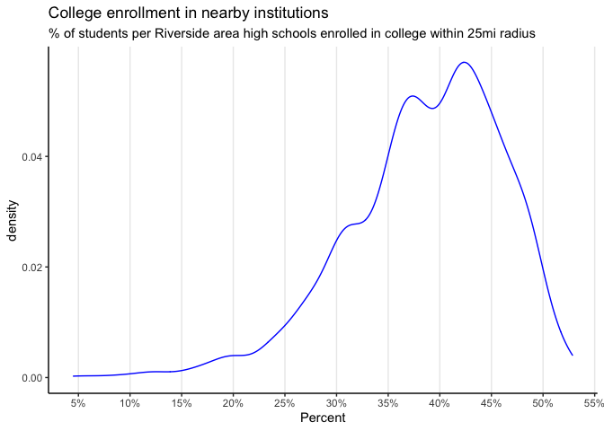
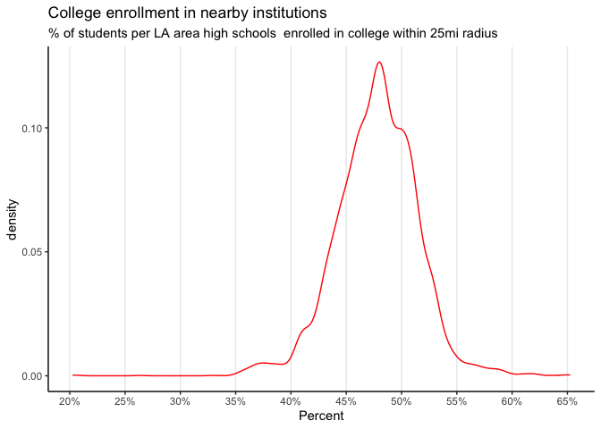
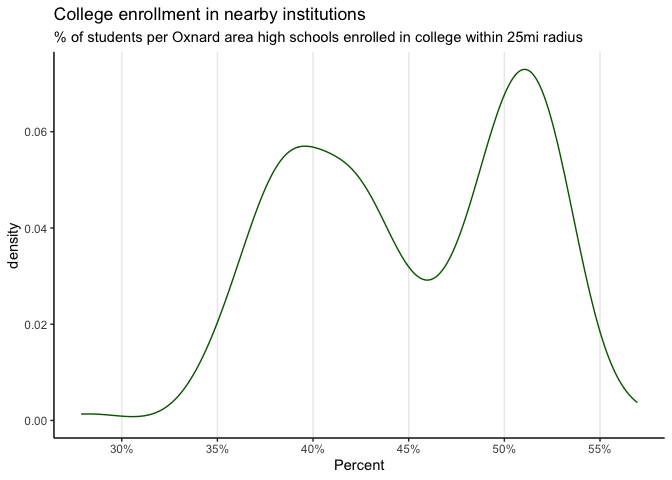

Meeting 17th
================
Jay Kim

# Notes:

  - ISSUES I RAN INTO ‘msaname15’ is not county, its cities: can we
    change our motivating question to ’How big cities compare to
    surrounding small CITIES (instead of counties?)

  - Things I like: i like how the base of our project is running
    comparisions -\> drawing inferences/conclusions. much more
    interesting than plotting 10-15 graphs, and then just summarizing
    what we see from the plots.

<!-- end list -->

``` r
library(tidyverse)
```

    ## ── Attaching packages ─────────────────────────────────────── tidyverse 1.3.0 ──

    ## ✓ ggplot2 3.3.2     ✓ purrr   0.3.4
    ## ✓ tibble  3.0.4     ✓ dplyr   1.0.2
    ## ✓ tidyr   1.1.2     ✓ stringr 1.4.0
    ## ✓ readr   1.3.1     ✓ forcats 0.5.0

    ## ── Conflicts ────────────────────────────────────────── tidyverse_conflicts() ──
    ## x dplyr::filter() masks stats::filter()
    ## x dplyr::lag()    masks stats::lag()

``` r
library(ggplot2)
library(readr)
library(ggalt)
```

    ## Registered S3 methods overwritten by 'ggalt':
    ##   method                  from   
    ##   grid.draw.absoluteGrob  ggplot2
    ##   grobHeight.absoluteGrob ggplot2
    ##   grobWidth.absoluteGrob  ggplot2
    ##   grobX.absoluteGrob      ggplot2
    ##   grobY.absoluteGrob      ggplot2

``` r
data <- read_csv("/Users/jaykim/Documents/EDA/eda20-team5-project/Jay's work/data.csv")
```

    ## Parsed with column specification:
    ## cols(
    ##   .default = col_double(),
    ##   geoid = col_character(),
    ##   msaname15 = col_character(),
    ##   countyfips = col_character(),
    ##   statefips = col_character(),
    ##   stateusps = col_character()
    ## )

    ## See spec(...) for full column specifications.

Overarching Question: How do Los Angeles, New York City, Philadelphia,
and Dallas differ in educational backgrounds/outcomes from not only each
other, but also with its surrounding cities/counties.

Sub-questions: 1. Does college degree matter? 2. Does poverty impact on
young children’s basic ability? what about high school students? 3. Does
preschool and ECE really matters for young children’s basic ability? 4.
If a teacher does not have a lot of experience, would it give bad impact
on student’s score/ability? 5. Is there a big difference between
students’ score depending on which race prevails in number? 6. students
living in a big city has better score than students living in suburb?

# Los Angeles + Counties

Main County/City: - Los Angeles-Long Beach-Anaheim, CA Metro Area

Surrounding Areas: - Riverside-San Bernardino-Ontario, CA Metro Area  
\- San Diego-Carlsbad, CA Metro Area - Oxnard-Thousand Oaks-Ventura, CA
Metro Area

Things I can compare: 1. College enrollment in nearby institutions  
Percentage 18-24 year-olds enrolled in college within 25-mile radius. 2.
HS grad rate before/after poverty rates 3. \# of students in AP courses
+ Single-headed households/Percentage workers commuting more than one
hour one way.?

# Background Analysis: Comparing each Californian city/county’s median household income.

Data manipulation: Median income for all diff cities in California:

``` r
#drop NAs in median income column
A <- data%>%
  drop_na(SE_MHE)

#dataframe of just county and each of their median household incomes.
california <- A%>%
  filter(stateusps =="CA")%>% #looking at only CA
  group_by(msaname15)%>%  #grouping by county
  summarise(mean_inc = mean(SE_MHE))%>% #averaging median household income
  drop_na(msaname15)%>% #cal dataframe has 1 NA in msaname15, so drop it.
#now need to create new column that has deviation from avg. ($60,824) 
  mutate(deviation= mean_inc - 60824)%>%
  mutate(region = sapply(strsplit(msaname15, ","),"[", 1)) #to truncate second half of name
```

    ## `summarise()` ungrouping output (override with `.groups` argument)

``` r
#california

#computed to get mean below
#california%>%
#  summarise(mean(mean_inc))
```

Plot of each counties’ median income dev from average: To use as
reference, and possible reasoning for conclusions we will draw later.

``` r
ggplot(california, aes(x = reorder(region, deviation), y = deviation,
           fill = deviation >0))+
  geom_bar(stat = "identity")+
  coord_flip()+
  scale_fill_discrete(name = "", labels = c("Below Average", "Above Average"))+
  labs(
    title="Household income",
    subtitle="We can see how each city is above or below the state average, $60,824",
    x = "City",
    y = "Amount Difference"
  )+
  theme_bw()
```

<!-- -->

``` r
#How do I drop the "CA, Metro Area"
```

# Analysis 1: AP classes x Single-headed households in CA

1)  Bar plot of all cities in California:

<!-- end list -->

``` r
data1 <-data %>% 
  drop_na(ED_APENR,SE_SINGLE) #getting rid of NA values
#ED_APENR : Ratio of students enrolled in at least one AP course to the number of 11th and 12th graders.

CA <- data1%>%
  filter(stateusps =="CA")%>% #looking at only CA
  group_by(msaname15)%>%  #group by cities/counties in CA
  summarise(avg_AP= mean(ED_APENR), avg_single = mean(SE_SINGLE))%>% 
  #column called "avg_AP" that is avg % of students in AP
  #column called "avg_single" that is average % of single headed households
  mutate(region = sapply(strsplit(msaname15, ","),"[", 1))%>%
  arrange(desc(avg_AP))
```

    ## `summarise()` ungrouping output (override with `.groups` argument)

``` r
ggplot(CA, aes(x=reorder(region, avg_AP), y=avg_AP))+
  geom_col(aes(col= avg_single, fill=avg_single))+
  labs(title="Percent of Students in AP Courses",
           y="Percent", 
           x="City")+
  theme_bw()+
  theme(axis.text.x = element_text(angle = 45, hjust = 1))
```

<!-- -->
Although the x axis is unreadable, we can see that interestingly, the
percent of students enrolled in AP courses are higher in cities. We will
see if there is still a correlation in the cities of southern
california\! :)

# Analysis 2: AP classes x Single-headed households in CA in SoCal (LA + surrounding areas)

1)  Histograms of LA Data manipulation:

<!-- end list -->

``` r
data1 <-data %>% 
  drop_na(ED_APENR,SE_SINGLE) #getting rid of NA values
#ED_APENR : Ratio of students enrolled in at least one AP course to the number of 11th and 12th graders.

LA <- data1%>%
  filter(msaname15 =="Los Angeles-Long Beach-Anaheim, CA Metro Area")%>% #looking at only LA
  group_by(geoid)%>%  #group by cities/counties in CA
  summarise(avg_AP= mean(ED_APENR), avg_single = mean(SE_SINGLE))%>% #column called "avg_AP" that is avg % of students in AP
                                                                  #column called "avg_single" that is average % of single headed households
  arrange(desc(avg_AP))
```

    ## `summarise()` ungrouping output (override with `.groups` argument)

``` r
#LA 

#compare 'CA' with % of AP enrolled after u take out cities that have % of singleheaded household >30
LA_less_single <- LA%>%
  filter(avg_single<15)%>%
  arrange(desc(avg_single))
#LA_less_single
```

Plots:

``` r
a<- ggplot(LA, aes(x=avg_AP))+
  #geom_histogram(aes(y = ..density..),colour = "black", fill = "white", binwidth = 0.015)+
  geom_density(alpha = .2, fill="pink")+
  labs(
    title="Ratio of students enrolled in at least one AP course to the number of 11th and 12th graders.",
    x="% in AP courses",
    y="Frequency"
  )+
  theme_bw()
a
```

<!-- -->

``` r
b<- ggplot(LA_less_single, aes(x=avg_AP))+
  #geom_histogram(aes(y = ..density..), colour = "black", fill = "white", binwidth = 0.015)+
  geom_density(alpha = .2, fill="blue")+
   labs(
    title="Ratio of students enrolled in at least one AP course to the number of 11th and 12th graders.",
    subtitle="Here we only have students from towns where % of single-headed households is less than 15%",
    x="% in AP courses",
    y="Frequency"
  )+
  theme_classic()+
  theme(panel.grid.major.x=element_line())
b
```

<!-- -->

``` r
#which backround is better?
#Grid lines?
```

2)  Surrounding cities of Los Angeles:

<!-- end list -->

  - Riverside-San Bernardino-Ontario, CA Metro Area  
  - San Diego-Carlsbad, CA Metro Area
  - Oxnard-Thousand Oaks-Ventura, CA Metro Area

Data manipulation:

``` r
data1 <-data %>% 
  drop_na(ED_APENR,SE_SINGLE) #getting rid of NA values
#ED_APENR : Ratio of students enrolled in at least one AP course to the number of 11th and 12th graders.

surround_LA <- data1%>%
  filter(msaname15 == c("Riverside-San Bernardino-Ontario, CA Metro Area", "San Diego-Carlsbad, CA Metro Area"))%>% #looking surrounding cities
  group_by(geoid)%>%  #group by cities/counties in CA
  summarise(avg_AP= mean(ED_APENR), avg_single = mean(SE_SINGLE))%>% 
  #column called "avg_AP" that is avg % of students in AP
  #column called "avg_single" that is average % of single headed households
  arrange(desc(avg_AP))
```

    ## `summarise()` ungrouping output (override with `.groups` argument)

``` r
#surround_LA 

#compare 'CA' with % of AP enrolled after u take out cities that have % of singleheaded household >315
subLA_less_single <- surround_LA%>%
  filter(avg_single<15)%>%
  arrange(desc(avg_single))
#subLA_less_single
```

Plots:

``` r
ggplot(surround_LA, aes(x=avg_AP))+
  #geom_histogram(aes(y = ..density..),colour = "black", fill = "white", binwidth = 0.015)+
  geom_density(alpha = .2, fill="lightsteelblue1")+
  labs(
    title="Ratio of students enrolled in at least one AP course to the number of 11th and 12th graders.",
    x="% in AP courses",
    y="Frequency"
  )+
  theme_classic()+ 
  theme(panel.grid.major.x=element_line())+ #add grid lines
  scale_x_continuous(
            breaks=seq(0, 1.5, 0.2),
            labels = function(x){paste0(x*1)}
            ) #change x axis labels
```

<!-- -->

``` r
ggplot(subLA_less_single, aes(x=avg_AP), add=TRUE)+
  #geom_histogram(aes(y = ..density..), colour = "black", fill = "white", binwidth = 0.015)+
  geom_density(alpha = .2, fill="thistle1", add=TRUE)+
   labs(
    title="Ratio of students enrolled in at least one AP course to the number of 11th and 12th graders.",
    subtitle="Here we only have students from towns where % of single-headed households is less than 15%",
    x="% in AP courses",
    y="Frequency"
  )+
  theme_classic()+ 
  theme(panel.grid.major.x=element_line())+ #add grid lines
  scale_x_continuous(
            breaks=seq(0, 1.5, 0.2),
            labels = function(x){paste0(x*1)}
            ) #change x axis labels
```

    ## Warning: Ignoring unknown parameters: add

<!-- -->

# Analysis 3: see how HS grad rates changed from 2010 to 2015

  - Los Angeles-Long Beach-Anaheim, CA Metro Area
  - Riverside-San Bernardino-Ontario, CA Metro Area  
  - San Diego-Carlsbad, CA Metro Area
  - Oxnard-Thousand Oaks-Ventura, CA Metro Area

data manip:

``` r
data5 <-data %>% 
  drop_na(ED_HSGRAD) #getting rid of NA values

#average grad rates in 2015
grad_rates_15<- data5%>%
  filter(msaname15 %in% c("Riverside-San Bernardino-Ontario, CA Metro Area", "San Diego-Carlsbad, CA Metro Area","Oxnard-Thousand Oaks-Ventura, CA Metro Area","Los Angeles-Long Beach-Anaheim, CA Metro Area" ))%>%
  filter(year == '2015')%>%
  group_by(msaname15, year)%>%
  summarise(mean_grad_2015 = mean(ED_HSGRAD))%>%
  mutate(region = sapply(strsplit(msaname15, ","),"[", 1))
```

    ## `summarise()` regrouping output by 'msaname15' (override with `.groups` argument)

``` r
#grad_rates_15


#average grad rates in 2010
grad_rates_10<- data5%>%
  filter(msaname15 %in% c("Riverside-San Bernardino-Ontario, CA Metro Area", "San Diego-Carlsbad, CA Metro Area","Oxnard-Thousand Oaks-Ventura, CA Metro Area","Los Angeles-Long Beach-Anaheim, CA Metro Area" ))%>%
  filter(year == '2010')%>%
  group_by(msaname15, year)%>%
  summarise(mean_grad_2010 = mean(ED_HSGRAD))%>%
  mutate(region = sapply(strsplit(msaname15, ","),"[", 1))
```

    ## `summarise()` regrouping output by 'msaname15' (override with `.groups` argument)

``` r
#grad_rates_10

#Join on msaname15
grad_rate<- inner_join(grad_rates_10,grad_rates_15, by= "region")%>%
  select(region, year.x, year.y, mean_grad_2010, mean_grad_2015) #selecting relevant columns
#grad_rate 
```

``` r
ggplot(grad_rate, aes(y=region, x = mean_grad_2015, xend = mean_grad_2010)) + 
        geom_dumbbell(color= "olivedrab", 
                      size=0.75, 
                      point.colour.l="black") +
  labs(title = "Change in high school graduation rate", 
       x = "Percent Graduated",
       y = "Region")+
  theme_classic()+
  theme(panel.grid.major.x=element_line())+
   scale_x_continuous(
            breaks=seq(76, 82, 0.5),
            labels = function(x){paste0(x*1, '%')}
            )
```

    ## Warning: Ignoring unknown parameters: point.colour.l

<!-- -->

``` r
#or
#   scale_x_continuous(
#            breaks=seq(76, 82, 0.5),
#            labels = function(x){paste0(x*1, '%')}
#            )
  
#how to indicate which change is positive vs negative
#ifelse(mean_grad_2015 > mean_grad_2010, "red", "blue" : not working
#idk how to drop "Metro Area"
#how to add percent symbols 
```

# Analysis 4: College enrollment in nearby institutions

Percentage 18-24 year-olds enrolled in college within 25-mile radius.
This can be 1 histogram

``` r
#4 diff datasets each for 4 diff regions
college_enrolled_R <- data%>%
  filter(msaname15 == "Riverside-San Bernardino-Ontario, CA Metro Area")

college_enrolled_LA <- data%>%
  filter(msaname15 == "Los Angeles-Long Beach-Anaheim, CA Metro Area")

college_enrolled_SD <- data%>%
  filter(msaname15 == "San Diego-Carlsbad, CA Metro Area")

college_enrolled_Ox <- data%>%
  filter(msaname15 == "Oxnard-Thousand Oaks-Ventura, CA Metro Area")
```

``` r
#4 plots of each region's HS grad rates

ggplot(college_enrolled_R, aes(x=ED_COLLEGE))+
  geom_density(alpha = .2, col="blue")+
  labs(title = "College enrollment in nearby institutions",
    subtitle="% of students per Riverside area high schools enrolled in college within 25mi radius",
       x="Percent"
       )+
  theme_classic()+ 
  theme(panel.grid.major.x=element_line())+ #add grid lines
  scale_x_continuous(
            breaks=seq(0, 75, 5),
            labels = function(x){paste0(x*1, "%")}
            ) #change x axis labels
```

<!-- -->

``` r
ggplot(college_enrolled_LA, aes(x=ED_COLLEGE))+
  geom_density(alpha = .2, col="red")+
  labs(title = "College enrollment in nearby institutions",
       subtitle="% of students per LA area high schools  enrolled in college within 25mi radius",
       x="Percent"
       )+
  theme_classic()+ 
  theme(panel.grid.major.x=element_line())+ #add grid lines
  scale_x_continuous(
            breaks=seq(0, 75, 5),
            labels = function(x){paste0(x*1, "%")}
            ) #change x axis labels
```

<!-- -->

``` r
ggplot(college_enrolled_Ox, aes(x=ED_COLLEGE))+
  geom_density(alpha = .2, col="darkgreen")+
  labs(title = "College enrollment in nearby institutions",
       subtitle="% of students per Oxnard area high schools enrolled in college within 25mi radius",
       x="Percent"
       )+
  theme_classic()+ 
  theme(panel.grid.major.x=element_line())+ #add grid lines
  scale_x_continuous(
            breaks=seq(0, 75, 5),
            labels = function(x){paste0(x*1, "%")}
            ) #change x axis labels
```

<!-- -->

``` r
ggplot(college_enrolled_SD, aes(x=ED_COLLEGE))+
  geom_density(alpha = .2, col="purple")+
  labs(title = "College enrollment in nearby institutions",
       subtitle="% of students per San Diego Area high schools enrolled in college within 25mi radius",
       x="Percent"
       )+
  theme_classic()+ 
  theme(panel.grid.major.x=element_line())+ #add grid lines
  scale_x_continuous(
            breaks=seq(0, 75, 5),
            labels = function(x){paste0(x*1, "%")}
            ) #change x axis labels
```

<!-- -->
