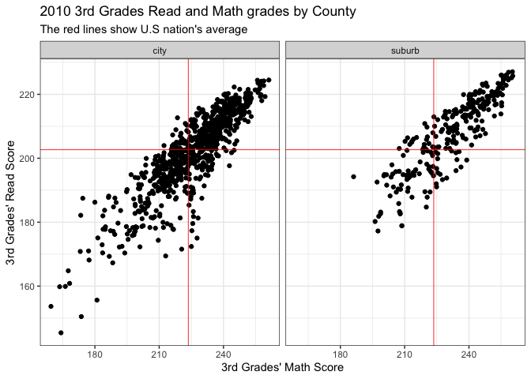
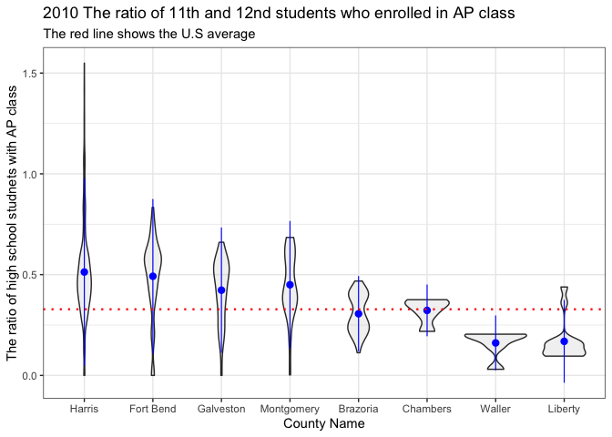
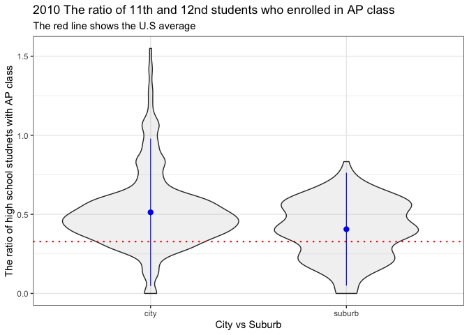
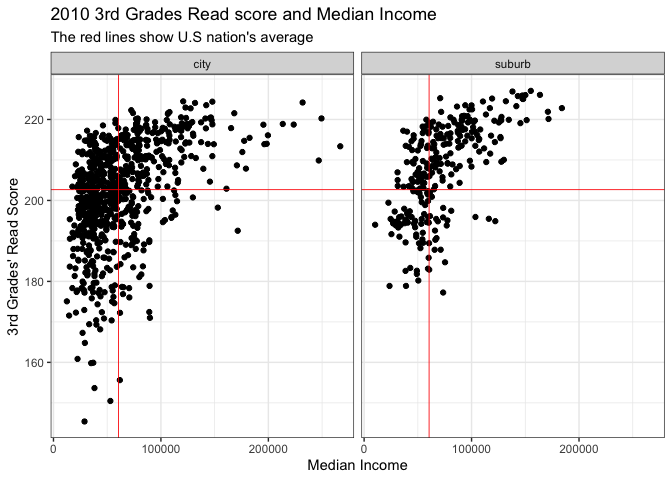
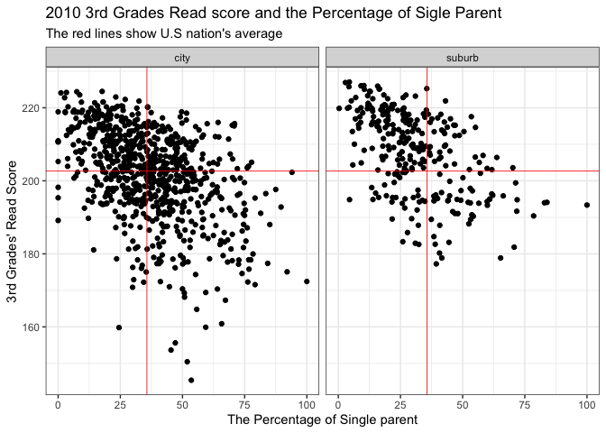
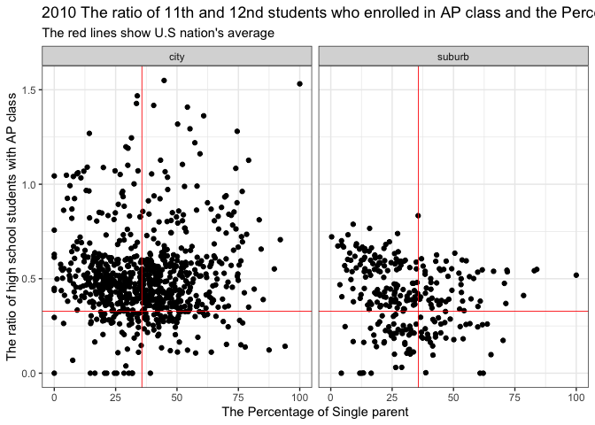
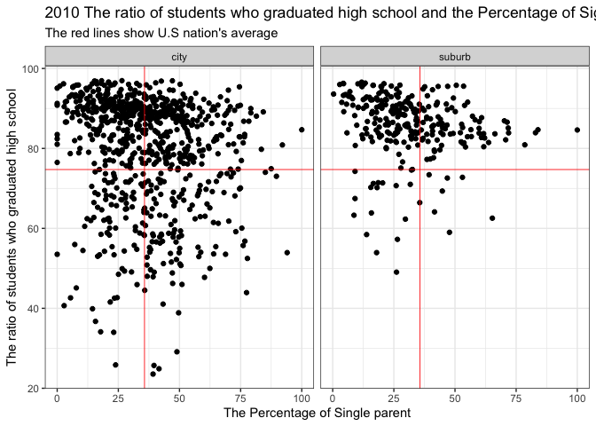
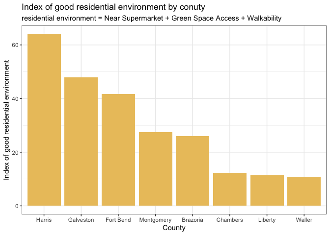

EDA\_team5\_final
================
Jay Kim, Soyeon Park, Tonnar Castellano, Ty Painter

# Necessary Libraries

``` r
library(tidyverse)
```

    ## ── Attaching packages ─────────────────────────────────────── tidyverse 1.3.0 ──

    ## ✓ ggplot2 3.3.2     ✓ purrr   0.3.4
    ## ✓ tibble  3.0.4     ✓ dplyr   1.0.2
    ## ✓ tidyr   1.1.2     ✓ stringr 1.4.0
    ## ✓ readr   1.3.1     ✓ forcats 0.5.0

    ## ── Conflicts ────────────────────────────────────────── tidyverse_conflicts() ──
    ## x dplyr::filter() masks stats::filter()
    ## x dplyr::lag()    masks stats::lag()

``` r
library(ggplot2)

library(dplyr, warn.conflicts = FALSE)
options(dplyr.summarise.inform = FALSE)
```

## Basic importating

``` r
# Import data
df <- read_csv('../../Data Basics/data.csv')
```

## Basic Exporlation

``` r
is.data.frame(df)
```

    ## [1] TRUE

``` r
dim(df)
```

    ## [1] 146112     39

``` r
head(df)
```

    ## # A tibble: 6 x 39
    ##   `_id` geoid  year in100 msaid15 msaname15 countyfips statefips stateusps   pop
    ##   <dbl> <chr> <dbl> <dbl>   <dbl> <chr>     <chr>      <chr>     <chr>     <dbl>
    ## 1     1 0100…  2010     0   33860 Montgome… 01001      01        AL          424
    ## 2     2 0100…  2015     0   33860 Montgome… 01001      01        AL          414
    ## 3     3 0100…  2010     0   33860 Montgome… 01001      01        AL          497
    ## 4     4 0100…  2015     0   33860 Montgome… 01001      01        AL          508
    ## 5     5 0100…  2010     0   33860 Montgome… 01001      01        AL          878
    ## 6     6 0100…  2015     0   33860 Montgome… 01001      01        AL          804
    ## # … with 29 more variables: ED_APENR <dbl>, ED_ATTAIN <dbl>, ED_COLLEGE <dbl>,
    ## #   ED_ECENROL <dbl>, ED_HSGRAD <dbl>, ED_MATH <dbl>, ED_READING <dbl>,
    ## #   ED_SCHPOV <dbl>, ED_TEACHXP <dbl>, ED_PRXECE <dbl>, ED_PRXHQECE <dbl>,
    ## #   HE_FOOD <dbl>, HE_GREEN <dbl>, HE_HEAT <dbl>, HE_HLTHINS <dbl>,
    ## #   HE_OZONE <dbl>, HE_PM25 <dbl>, HE_VACANCY <dbl>, HE_WALK <dbl>,
    ## #   HE_SUPRFND <dbl>, HE_RSEI <dbl>, SE_POVRATE <dbl>, SE_PUBLIC <dbl>,
    ## #   SE_HOME <dbl>, SE_OCC <dbl>, SE_MHE <dbl>, SE_EMPRAT <dbl>,
    ## #   SE_JOBPROX <dbl>, SE_SINGLE <dbl>

``` r
summary(df)
```

    ##       _id            geoid                year          in100      
    ##  Min.   :     1   Length:146112      Min.   :2010   Min.   :0.000  
    ##  1st Qu.: 36529   Class :character   1st Qu.:2010   1st Qu.:0.000  
    ##  Median : 73056   Mode  :character   Median :2012   Median :1.000  
    ##  Mean   : 73056                      Mean   :2012   Mean   :0.698  
    ##  3rd Qu.:109584                      3rd Qu.:2015   3rd Qu.:1.000  
    ##  Max.   :146112                      Max.   :2015   Max.   :1.000  
    ##                                                     NA's   :10760  
    ##     msaid15       msaname15          countyfips         statefips        
    ##  Min.   :10100   Length:146112      Length:146112      Length:146112     
    ##  1st Qu.:19740   Class :character   Class :character   Class :character  
    ##  Median :32660   Mode  :character   Mode  :character   Mode  :character  
    ##  Mean   :30482                                                           
    ##  3rd Qu.:39300                                                           
    ##  Max.   :49820                                                           
    ##  NA's   :10760                                                           
    ##   stateusps              pop           ED_APENR        ED_ATTAIN     
    ##  Length:146112      Min.   :    0   Min.   :0.0000   Min.   :  0.00  
    ##  Class :character   1st Qu.:  583   1st Qu.:0.1721   1st Qu.: 14.17  
    ##  Mode  :character   Median :  900   Median :0.3149   Median : 23.41  
    ##                     Mean   : 1010   Mean   :0.3461   Mean   : 28.54  
    ##                     3rd Qu.: 1301   3rd Qu.:0.4851   3rd Qu.: 39.27  
    ##                     Max.   :23608   Max.   :2.2300   Max.   :100.00  
    ##                                     NA's   :1701     NA's   :1289    
    ##    ED_COLLEGE        ED_ECENROL       ED_HSGRAD           ED_MATH       
    ##  Min.   :  0.159   Min.   :  0.00   Min.   :  0.5936   Min.   :  7.354  
    ##  1st Qu.: 34.184   1st Qu.: 29.30   1st Qu.: 68.0096   1st Qu.:195.980  
    ##  Median : 41.025   Median : 48.40   Median : 80.7332   Median :225.678  
    ##  Mean   : 41.009   Mean   : 49.51   Mean   : 76.6837   Mean   :221.758  
    ##  3rd Qu.: 47.402   3rd Qu.: 69.20   3rd Qu.: 88.7903   3rd Qu.:248.397  
    ##  Max.   :100.000   Max.   :100.00   Max.   :100.0000   Max.   :504.966  
    ##  NA's   :6811      NA's   :4951     NA's   :1970       NA's   :2465     
    ##    ED_READING        ED_SCHPOV        ED_TEACHXP        ED_PRXECE    
    ##  Min.   :  8.616   Min.   :  0.00   Min.   :  0.000   Min.   :0.000  
    ##  1st Qu.:175.879   1st Qu.: 37.13   1st Qu.:  5.115   1st Qu.:2.367  
    ##  Median :204.908   Median : 57.27   Median :  9.466   Median :3.843  
    ##  Mean   :202.447   Mean   : 55.68   Mean   : 11.715   Mean   :3.563  
    ##  3rd Qu.:227.833   3rd Qu.: 75.79   3rd Qu.: 15.271   3rd Qu.:4.782  
    ##  Max.   :536.162   Max.   :100.00   Max.   :100.000   Max.   :7.183  
    ##  NA's   :2466      NA's   :1395     NA's   :1472      NA's   :4156   
    ##   ED_PRXHQECE         HE_FOOD            HE_GREEN        HE_HEAT      
    ##  Min.   :-13.816   Min.   :  0.0000   Min.   : 0.00   Min.   :  0.00  
    ##  1st Qu.:-13.816   1st Qu.:  0.9872   1st Qu.: 4.50   1st Qu.:  8.00  
    ##  Median :  0.476   Median :  2.7473   Median :24.40   Median : 23.00  
    ##  Mean   : -3.540   Mean   :  4.5247   Mean   :28.04   Mean   : 41.13  
    ##  3rd Qu.:  1.792   3rd Qu.:  5.6852   3rd Qu.:45.70   3rd Qu.: 71.33  
    ##  Max.   :  5.145   Max.   :100.0000   Max.   :96.30   Max.   :145.33  
    ##  NA's   :4156      NA's   :384        NA's   :1366    NA's   :1080    
    ##    HE_HLTHINS        HE_OZONE        HE_PM25         HE_VACANCY     
    ##  Min.   :  0.00   Min.   :18.65   Min.   : 2.642   Min.   :  0.000  
    ##  1st Qu.: 80.14   1st Qu.:36.38   1st Qu.: 8.301   1st Qu.:  4.234  
    ##  Median : 87.34   Median :38.41   Median : 9.742   Median :  7.355  
    ##  Mean   : 85.39   Mean   :38.83   Mean   : 9.620   Mean   :  8.785  
    ##  3rd Qu.: 92.69   3rd Qu.:41.35   3rd Qu.:10.880   3rd Qu.: 11.665  
    ##  Max.   :100.00   Max.   :56.99   Max.   :17.051   Max.   :100.000  
    ##  NA's   :1500     NA's   :1546    NA's   :1546     NA's   :1597     
    ##     HE_WALK         HE_SUPRFND         HE_RSEI          SE_POVRATE    
    ##  Min.   : 1.000   Min.   :-13.816   Min.   :-17.749   Min.   :  0.00  
    ##  1st Qu.: 6.090   1st Qu.:-13.816   1st Qu.:  5.093   1st Qu.:  6.72  
    ##  Median : 8.421   Median :-13.816   Median :  6.784   Median : 12.51  
    ##  Mean   : 9.150   Mean   :-12.989   Mean   :  6.300   Mean   : 15.85  
    ##  3rd Qu.:12.489   3rd Qu.:-13.816   3rd Qu.:  8.292   3rd Qu.: 21.60  
    ##  Max.   :20.000   Max.   :  1.609   Max.   : 17.235   Max.   :100.00  
    ##  NA's   :1338                                         NA's   :1553    
    ##    SE_PUBLIC          SE_HOME           SE_OCC           SE_MHE      
    ##  Min.   :  0.000   Min.   :  0.00   Min.   :  0.00   Min.   :  2499  
    ##  1st Qu.:  5.029   1st Qu.: 49.77   1st Qu.: 24.15   1st Qu.: 40516  
    ##  Median : 10.552   Median : 69.21   Median : 32.68   Median : 54393  
    ##  Mean   : 13.862   Mean   : 63.99   Mean   : 34.92   Mean   : 61084  
    ##  3rd Qu.: 19.175   3rd Qu.: 81.96   3rd Qu.: 44.16   3rd Qu.: 74384  
    ##  Max.   :100.000   Max.   :100.00   Max.   :100.00   Max.   :266907  
    ##  NA's   :1636      NA's   :1636     NA's   :1508     NA's   :1900    
    ##    SE_EMPRAT        SE_JOBPROX        SE_SINGLE     
    ##  Min.   :  0.00   Min.   :  0.000   Min.   :  0.00  
    ##  1st Qu.: 70.09   1st Qu.:  3.371   1st Qu.: 21.33  
    ##  Median : 77.33   Median :  6.367   Median : 33.00  
    ##  Mean   : 75.01   Mean   :  8.493   Mean   : 35.93  
    ##  3rd Qu.: 82.69   3rd Qu.: 11.303   3rd Qu.: 47.55  
    ##  Max.   :100.00   Max.   :100.000   Max.   :100.00  
    ##  NA's   :1332     NA's   :1488      NA's   :2173

This data is about child opportunity index in United States. It has
146112 rows and 39 columns. The unit of analysis is town and each row
shows a town’s properties related to child education in 2010 and 2015.
The shape of data is long and the class of data is dataframe.

# Data Cleaning

## Column names

Since there are so many observations in the data, we are going to focus
on a specific state, Tennessee.

``` r
# Separate the column "msaname15" into "city", "state", "size" and "no_mean"
df <- df %>% 
  separate(msaname15, c("city", "state", "size", "no_mean"), sep = " ")
```

According to the data dictionary, the unit of the 4
columns(“ED\_PRXECE”, “ED\_PRXHQECE”, “HE\_SUPRFND”, “HE\_RSEI”) in
the data is natural log. Natural log units change values less than
e(2.71828) into negative numbers and this makes analysis difficult.
Therefore, we are going to change the value of these 4 columns into
original unit by using exp function.

``` r
df <- df %>% 
  mutate(ED_PRXECE_NM = exp(ED_PRXECE)) %>%
  mutate(ED_PRXHQECE_NM = exp(ED_PRXHQECE)) %>%
  mutate(HE_SUPRFND_NM = exp(HE_SUPRFND)) %>%
  mutate(HE_RSEI_NM = exp(HE_RSEI)) %>%
  select(-ED_PRXECE, -ED_PRXHQECE, -HE_SUPRFND, -HE_RSEI)
```

Most of the columns are hard to understand. We tried to make it easier
and obvious even without the data dictionary.

``` r
df <- df %>% 
  rename(id = `_id`) %>% 
  rename(geo_id = geoid) %>% 
  rename(metro_areas = in100) %>%
  rename(area_code = msaid15) %>% 
  rename(county_code = countyfips) %>%
  rename(num_under_18 = pop) %>% 
  rename(ratio_students_AP_enrolled = ED_APENR) %>%
  rename(perc_over24_college_degree = ED_ATTAIN) %>%
  rename(perc_18to24_nearby_college_enrolled = ED_COLLEGE) %>%
  rename(perc_3to4_school_enrolled = ED_ECENROL) %>%
  rename(perc_high_grad = ED_HSGRAD) %>%
  rename(score_third_grade_math = ED_MATH) %>%
  rename(score_third_grade_read = ED_READING) %>%
  rename(perc_elementary_school_poverty = ED_SCHPOV) %>% 
  rename(perc_teacher_1and2_years=ED_TEACHXP) %>% 
  rename(num_ECE_nearby = ED_PRXECE_NM) %>% 
  rename(num_high_qual_ECE_nearby = ED_PRXHQECE_NM) %>% 
  rename(perc_supermarket_nearby = HE_FOOD) %>% 
  rename(perc_green_space_access = HE_GREEN) %>%
  rename(days_temp_above90 = HE_HEAT) %>%
  rename(perc_0to64_health_insurance = HE_HLTHINS) %>%
  rename(mean_ozone_amount = HE_OZONE) %>%
  rename(mean_microparticle = HE_PM25) %>%
  rename(perc_housing_vacancy = HE_VACANCY) %>%
  rename(index_walkability = HE_WALK) %>% 
  rename(num_waste_dump_sites = HE_SUPRFND_NM) %>%
  rename(index_air_pollutants = HE_RSEI_NM) %>%
  rename(perc_below100_poverty = SE_POVRATE) %>%
  rename(perc_household_public_assistance = SE_PUBLIC) %>%
  rename(perc_home_ownership = SE_HOME) %>%
  rename(perc_over15_high_skill = SE_OCC) %>%
  rename(median_income=SE_MHE) %>%
  rename(perc_adults_employed = SE_EMPRAT) %>%
  rename(perc_worker_commute_over1hour = SE_JOBPROX) %>%
  rename(perc_single_parent = SE_SINGLE)
```

``` r
df_2010 <- df %>% filter(year == "2010")
df_2015 <- df %>% filter(year == "2015")
```

Deleted unnecessary columns (They have the same values.)

``` r
df_tx <- df %>% filter((county_code == "48201") | (county_code == "48157")| (county_code == "48339")|(county_code == "48167")|(county_code == "48039")|(county_code == "48291")|(county_code == "48473")|(county_code == "48071"))
```

``` r
df_tx <- df_tx %>% mutate(group = ifelse(county_code == "48201", "city", "suburb")) %>%
  select(group, everything())
```

``` r
df_tx <- df_tx %>% mutate(county_name = case_when(county_code == "48201" ~ "Harris", county_code == "48157" ~ "Fort Bend", county_code == "48339" ~ "Montgomery", county_code == "48167" ~ "Galveston", county_code == "48039" ~ "Brazoria", county_code == "48291" ~ "Liberty", county_code == "48473" ~ "Waller", county_code == "48071" ~ "Chambers"))
```

``` r
df_tx$county_name = factor(df_tx$county_name, levels = c("Harris", "Fort Bend", "Galveston", "Montgomery", "Brazoria", "Chambers", "Waller", "Liberty"))
```

This is the final data after cleaning columns and values.

``` r
df_tx_2010 <- df_tx %>% filter(year == "2010")
df_tx_2015 <- df_tx %>% filter(year == "2015")
```

# Q1. Is there any difference in young children(13-14 years-old)’s math and reading ability by county? - Primary school

``` r
ggplot(df_tx_2010, aes(x = score_third_grade_math, y = score_third_grade_read)) + 
  geom_point(size = .5) +
  facet_wrap(~county_name, nrow = 2) +
  geom_hline(data = df_2010, aes(yintercept = mean(score_third_grade_read, na.rm = TRUE)), col = "red", lwd = .3) + 
  geom_vline(data = df_2010, aes(xintercept = mean(score_third_grade_math, na.rm = TRUE)), col = "red", lwd = .3) +
  theme_bw() + 
  labs(title = "2010 3rd Grades Read and Math grades by County", subtitle = "The red lines show U.S nation's average", x = "3rd Grades' Math Score", y = "3rd Grades' Read Score")
```

    ## Warning: Removed 4 rows containing missing values (geom_point).

<!-- -->

# Q1-1. Is there any difference in young children(13-14 years-old)’s math and reading ability depending on city and suburb? - Primary School

``` r
ggplot(df_tx_2010, aes(x = score_third_grade_math, y = score_third_grade_read)) + 
  geom_point() +
  facet_wrap(~group, nrow = 1) +
  geom_hline(data = df_2010, aes(yintercept = mean(score_third_grade_read, na.rm = TRUE)), col = "red", lwd = .3) + 
  geom_vline(data = df_2010, aes(xintercept = mean(score_third_grade_math, na.rm = TRUE)), col = "red", lwd = .3) +
  theme_bw() + 
  labs(title = "2010 3rd Grades Read and Math grades by County", subtitle = "The red lines show U.S nation's average", x = "3rd Grades' Math Score", y = "3rd Grades' Read Score")
```

    ## Warning: Removed 4 rows containing missing values (geom_point).

<!-- -->

# Q2. Is there any difference in teenager(17-18 years-old)’s study ability by country? - High School

``` r
ggplot(df_tx_2010, aes(x = county_name, y = ratio_students_AP_enrolled)) + 
  geom_violin(fill = "gray", alpha = 0.2) + 
  stat_summary(fun.data=mean_sdl, mult=1, geom="pointrange", color="blue", lwd = 0.4) + 
  theme_bw() + 
  scale_x_discrete(limits = c("Harris", "Fort Bend", "Galveston", "Montgomery", "Brazoria", "Chambers", "Waller", "Liberty")) + 
  geom_hline(yintercept = mean(df_2010$ratio_students_AP_enrolled, na.rm = TRUE), col = "red", lwd = 0.8, linetype = "dotted") + 
  labs(title = "2010 The ratio of 11th and 12nd students who enrolled in AP class", subtitle = "The red line shows the U.S average", x = "County Name", y = "The ratio of high school studnets with AP class")
```

<!-- -->

# Q2-2. Is there any difference in teenager(17-18 years-old)’s study ability depending on city and suburb? - High School

``` r
ggplot(df_tx_2010, aes(x = group, y = ratio_students_AP_enrolled)) + 
  geom_violin(fill = "gray", alpha = 0.2) + 
  stat_summary(fun.data=mean_sdl, mult=1, geom="pointrange", color="blue", lwd = 0.4) + 
  theme_bw() + 
  geom_hline(yintercept = mean(df_2010$ratio_students_AP_enrolled, na.rm = TRUE), col = "red", lwd = 0.8, linetype = "dotted") + 
  labs(title = "2010 The ratio of 11th and 12nd students who enrolled in AP class", subtitle = "The red line shows the U.S average", x = "City vs Suburb", y = "The ratio of high school studnets with AP class")
```

<!-- -->

# Q3. Is there any relationship between household income and young children’s study ability?

``` r
options(scipen = 999)

ggplot(df_tx_2010, aes(x = median_income, y = score_third_grade_read)) + 
  geom_point() +
  facet_wrap(~group) +
  geom_hline(data = df_2010, aes(yintercept = mean(score_third_grade_read, na.rm = TRUE)), col = "red", lwd = .3) + 
  geom_vline(data = df_2010, aes(xintercept = mean(median_income, na.rm = TRUE)), col = "red", lwd = .3) +
  theme_bw() + 
  labs(title = "2010 3rd Grades Read score and Median Income", subtitle = "The red lines show U.S nation's average", x = "Median Income", y = "3rd Grades' Read Score")
```

    ## Warning: Removed 8 rows containing missing values (geom_point).

<!-- -->

# Q4. Is there any relationship between single parent and young children’s study ability?

``` r
options(scipen = 999)

ggplot(df_tx_2010, aes(x = perc_single_parent, y = score_third_grade_read)) + 
  geom_point() +
  facet_wrap(~group) +
  geom_hline(data = df_2010, aes(yintercept = mean(score_third_grade_read, na.rm = TRUE)), col = "red", lwd = .3) + 
  geom_vline(data = df_2010, aes(xintercept = mean(perc_single_parent, na.rm = TRUE)), col = "red", lwd = .3) +
  theme_bw() + 
  labs(title = "2010 3rd Grades Read score and the Percentage of Sigle Parent", subtitle = "The red lines show U.S nation's average", x = "The Percentage of Single parent", y = "3rd Grades' Read Score")
```

    ## Warning: Removed 9 rows containing missing values (geom_point).

<!-- -->

# Q4. Is there any relationship between single parent and young children’s study ability?

``` r
options(scipen = 999)

ggplot(df_tx_2010, aes(x = perc_single_parent, y = ratio_students_AP_enrolled)) + 
  geom_point() +
  facet_wrap(~group) +
  geom_hline(data = df_2010, aes(yintercept = mean(ratio_students_AP_enrolled, na.rm = TRUE)), col = "red", lwd = .3) + 
  geom_vline(data = df_2010, aes(xintercept = mean(perc_single_parent, na.rm = TRUE)), col = "red", lwd = .3) +
  theme_bw() + 
  labs(title = "2010 The ratio of 11th and 12nd students who enrolled in AP class and the Percentage of Sigle Parent", subtitle = "The red lines show U.S nation's average", x = "The Percentage of Single parent", y = "The ratio of high school students with AP class")
```

    ## Warning: Removed 9 rows containing missing values (geom_point).

<!-- -->

# Q5. Is there any relationship between single parent and teenager’s highshool graduation?

``` r
options(scipen = 999)

ggplot(df_tx_2010, aes(x = perc_single_parent, y = perc_high_grad)) + 
  geom_point() +
  facet_wrap(~group) +
  geom_hline(data = df_2010, aes(yintercept = mean(perc_high_grad, na.rm = TRUE)), col = "red", lwd = .3) + 
  geom_vline(data = df_2010, aes(xintercept = mean(perc_single_parent, na.rm = TRUE)), col = "red", lwd = .3) +
  theme_bw() + 
  labs(title = "2010 The ratio of students who graduated high school and the Percentage of Sigle Parent", subtitle = "The red lines show U.S nation's average", x = "The Percentage of Single parent", y = "The ratio of students who graduated high school")
```

    ## Warning: Removed 9 rows containing missing values (geom_point).

<!-- -->

# How is residential environment by county?

``` r
df_tx_2010_resi <- df_tx_2010 %>% filter(!is.na(perc_supermarket_nearby)) %>%
  filter(!is.na(perc_green_space_access)) %>%
  filter(!is.na(index_walkability)) %>%
  mutate(residential_environment = perc_supermarket_nearby + perc_green_space_access + index_walkability) %>%
  group_by(county_name) %>%
  summarise(resi_mean = mean(residential_environment))
```

``` r
ggplot(df_tx_2010_resi, aes(x = reorder(county_name, resi_mean, desc), y = resi_mean)) +
  geom_bar(stat = "identity", fill = "#EBC36A") +
  theme_bw() + 
  labs(title = "Index of good residential environment by conuty", subtitle = "residential environment = Near Supermarket + Green Space Access + Walkability", y = "Index of good residential environment", x = "County" )
```

<!-- -->

``` r
str(df)
```

    ## tibble [146,112 × 42] (S3: tbl_df/tbl/data.frame)
    ##  $ id                                 : num [1:146112] 1 2 3 4 5 6 7 8 9 10 ...
    ##  $ geo_id                             : chr [1:146112] "01001020100" "01001020100" "01001020200" "01001020200" ...
    ##  $ year                               : num [1:146112] 2010 2015 2010 2015 2010 ...
    ##  $ metro_areas                        : num [1:146112] 0 0 0 0 0 0 0 0 0 0 ...
    ##  $ area_code                          : num [1:146112] 33860 33860 33860 33860 33860 ...
    ##  $ city                               : chr [1:146112] "Montgomery," "Montgomery," "Montgomery," "Montgomery," ...
    ##  $ state                              : chr [1:146112] "AL" "AL" "AL" "AL" ...
    ##  $ size                               : chr [1:146112] "Metro" "Metro" "Metro" "Metro" ...
    ##  $ no_mean                            : chr [1:146112] "Area" "Area" "Area" "Area" ...
    ##  $ county_code                        : chr [1:146112] "01001" "01001" "01001" "01001" ...
    ##  $ statefips                          : chr [1:146112] "01" "01" "01" "01" ...
    ##  $ stateusps                          : chr [1:146112] "AL" "AL" "AL" "AL" ...
    ##  $ num_under_18                       : num [1:146112] 424 414 497 508 878 ...
    ##  $ ratio_students_AP_enrolled         : num [1:146112] 0.349 0.253 0.35 0.253 0.35 ...
    ##  $ perc_over24_college_degree         : num [1:146112] 23.8 37.8 24.2 16.2 14 ...
    ##  $ perc_18to24_nearby_college_enrolled: num [1:146112] 34.6 31.9 34.5 31.6 34.1 ...
    ##  $ perc_3to4_school_enrolled          : num [1:146112] 57.1 62.1 100 77.3 27.5 ...
    ##  $ perc_high_grad                     : num [1:146112] 78.1 87.4 77.9 87.4 77.7 ...
    ##  $ score_third_grade_math             : num [1:146112] 231 234 230 232 231 ...
    ##  $ score_third_grade_read             : num [1:146112] 215 215 214 215 215 ...
    ##  $ perc_elementary_school_poverty     : num [1:146112] 48 54.1 47.9 54.1 47.5 ...
    ##  $ perc_teacher_1and2_years           : num [1:146112] 1.49 17.08 1.55 17.36 1.66 ...
    ##  $ perc_supermarket_nearby            : num [1:146112] 6.38 3.11 11.63 7.89 4.31 ...
    ##  $ perc_green_space_access            : num [1:146112] 4 4 16.2 16.2 15.7 ...
    ##  $ days_temp_above90                  : num [1:146112] 106 86 106 86 106 ...
    ##  $ perc_0to64_health_insurance        : num [1:146112] 88.2 89.6 82.7 89.9 90.5 ...
    ##  $ mean_ozone_amount                  : num [1:146112] 41.3 37.1 41.3 37.1 41.3 ...
    ##  $ mean_microparticle                 : num [1:146112] 10.8 11.3 10.8 11.3 10.8 ...
    ##  $ perc_housing_vacancy               : num [1:146112] 12.71 1.44 4.59 10.82 16.24 ...
    ##  $ index_walkability                  : num [1:146112] 7.55 7.55 8.68 8.68 4.65 ...
    ##  $ perc_below100_poverty              : num [1:146112] 9.24 10.68 10.51 22.41 11.82 ...
    ##  $ perc_household_public_assistance   : num [1:146112] 14.4 12.07 13.03 24.14 9.04 ...
    ##  $ perc_home_ownership                : num [1:146112] 84.3 75.2 58.6 61.9 76.3 ...
    ##  $ perc_over15_high_skill             : num [1:146112] 28 38.5 40 30.5 31 ...
    ##  $ median_income                      : num [1:146112] 60321 67826 44039 41287 46002 ...
    ##  $ perc_adults_employed               : num [1:146112] 68.2 83 59.5 60.3 82.9 ...
    ##  $ perc_worker_commute_over1hour      : num [1:146112] 5.225 1.053 1.728 0.931 1.788 ...
    ##  $ perc_single_parent                 : num [1:146112] 17.3 26.6 48.8 47.5 32 ...
    ##  $ num_ECE_nearby                     : num [1:146112] 6.9 10.91 7.04 11 7.73 ...
    ##  $ num_high_qual_ECE_nearby           : num [1:146112] 0.000001 1 0.000001 1 0.000001 ...
    ##  $ num_waste_dump_sites               : num [1:146112] 0.000001 0.000001 0.000001 0.000001 0.000001 ...
    ##  $ index_air_pollutants               : num [1:146112] 378 1113 439 1491 474 ...

1.  New York, NY
2.  Los Angeles, CA
3.  Chicago, IL
4.  Houston, TX
5.  Philadelphia, PA
6.  Phoenix, AZ
7.  San Antonio, TX
8.  San Diego, CA
9.  Dallas, TX
10. San Jose, CA
11. Honolulu, HW
12. Austin, TX
13. Indianapolis, ID
14. Jacksonville, FL
15. San Francisco, CA
16. Columbus, Ohio
17. Cahrlotte, NC
18. Fort Worth, TX
19. Detroit, MI
20. El Paso, TX
