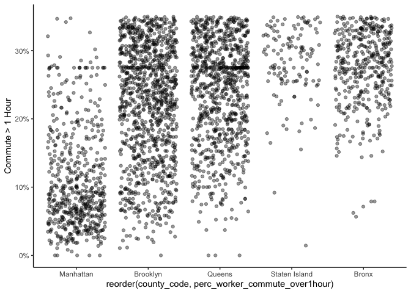
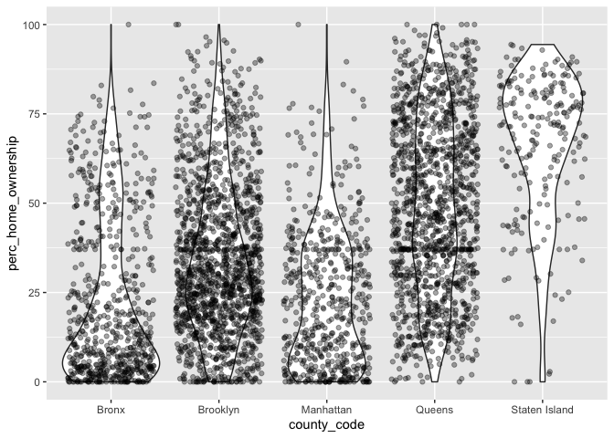
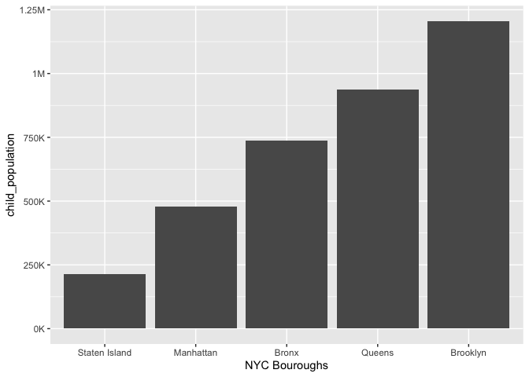
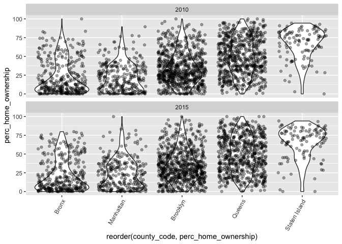

Apply EDA graphs to NYC
================

# Load Libraries

``` r
library(tidyverse)
```

    ## ── Attaching packages ─────────────────────────────────────── tidyverse 1.3.0 ──

    ## ✓ ggplot2 3.3.2     ✓ purrr   0.3.4
    ## ✓ tibble  3.0.4     ✓ dplyr   1.0.2
    ## ✓ tidyr   1.1.1     ✓ stringr 1.4.0
    ## ✓ readr   1.3.1     ✓ forcats 0.5.0

    ## ── Conflicts ────────────────────────────────────────── tidyverse_conflicts() ──
    ## x dplyr::filter() masks stats::filter()
    ## x dplyr::lag()    masks stats::lag()

``` r
library(ggplot2)
library(readr)
```

# Import Data

``` r
df <- read_csv('/Users/TyPainter1/Desktop/Masters/Fall\ 2020/DS-5610/eda20-team5-project/Data\ Basics/data.csv') 
```

# Clean Data

Most of the columns are hard to understand tried to make it easier

``` r
df <- df %>% 
  mutate(ED_PRXECE_NM = exp(ED_PRXECE)) %>%
  mutate(ED_PRXHQECE_NM = exp(ED_PRXHQECE)) %>%
  mutate(HE_SUPRFND_NM = exp(HE_SUPRFND)) %>%
  mutate(HE_RSEI_NM = exp(HE_RSEI)) %>%
  select(-ED_PRXECE, -ED_PRXHQECE, -HE_SUPRFND, -HE_RSEI)
```

Most of the columns are hard to understand. We tried to make it easier
and obvious even without the data dictionary.

``` r
df <- df %>% 
  rename(id = `_id`) %>% 
  rename(geo_id = geoid) %>% 
  rename(metro_areas = in100) %>%
  rename(area_code = msaid15) %>% 
  rename(county_code = countyfips) %>%
  rename(num_under_18 = pop) %>% 
  rename(ratio_students_AP_enrolled = ED_APENR) %>%
  rename(perc_over24_college_degree = ED_ATTAIN) %>%
  rename(perc_18to24_nearby_college_enrolled = ED_COLLEGE) %>%
  rename(perc_3to4_school_enrolled = ED_ECENROL) %>%
  rename(perc_high_grad = ED_HSGRAD) %>%
  rename(score_third_grade_math = ED_MATH) %>%
  rename(score_third_grade_read = ED_READING) %>%
  rename(perc_elementary_school_poverty = ED_SCHPOV) %>% 
  rename(perc_teacher_1and2_years=ED_TEACHXP) %>% 
  rename(num_ECE_nearby = ED_PRXECE_NM) %>% 
  rename(num_high_qual_ECE_nearby = ED_PRXHQECE_NM) %>% 
  rename(perc_supermarket_nearby = HE_FOOD) %>% 
  rename(perc_green_space_access = HE_GREEN) %>%
  rename(days_temp_above90 = HE_HEAT) %>%
  rename(perc_0to64_health_insurance = HE_HLTHINS) %>%
  rename(mean_ozone_amount = HE_OZONE) %>%
  rename(mean_microparticle = HE_PM25) %>%
  rename(perc_housing_vacancy = HE_VACANCY) %>%
  rename(index_walkability = HE_WALK) %>% 
  rename(num_waste_dump_sites = HE_SUPRFND_NM) %>%
  rename(index_air_pollutants = HE_RSEI_NM) %>%
  rename(perc_below100_poverty = SE_POVRATE) %>%
  rename(perc_household_public_assistance = SE_PUBLIC) %>%
  rename(perc_home_ownership = SE_HOME) %>%
  rename(perc_over15_high_skill = SE_OCC) %>%
  rename(median_income=SE_MHE) %>%
  rename(perc_adults_employed = SE_EMPRAT) %>%
  rename(perc_worker_commute_over1hour = SE_JOBPROX) %>%
  rename(perc_single_parent = SE_SINGLE)
```

# Exploratory Graphics

``` r
nyc <- df %>% 
  filter(
    county_code == '36061' |
    county_code ==  '36047' |
    county_code ==  '36081' |
    county_code ==  '36005' |
    county_code ==  '36085' 
)
nyc <- nyc %>%
  mutate(county_code = replace(county_code, county_code == '36061', 'Manhattan')) %>% 
  mutate(county_code = replace(county_code, county_code == '36047', 'Brooklyn')) %>%
  mutate(county_code =  replace(county_code, county_code == '36081', 'Queens')) %>%
  mutate(county_code =  replace(county_code, county_code == '36005', 'Bronx')) %>%
  mutate(county_code =  replace(county_code, county_code == '36085', 'Staten Island'))%>%
  mutate_all(~ifelse(is.na(.x), mean(.x, na.rm = TRUE), .x))

ggplot(nyc, aes(x = reorder(county_code, perc_worker_commute_over1hour), y = perc_worker_commute_over1hour)) +
  geom_jitter(alpha=.4) +
  labs(y = "Commute > 1 Hour") +
  scale_y_continuous(labels = function(x){paste0(x, "%")}, limits = c(0, 35)) +
  theme_classic()
```

    ## Warning: Removed 1292 rows containing missing values (geom_point).

<!-- -->

``` r
ggplot(nyc, aes(x = reorder(county_code, perc_home_ownership), y = perc_home_ownership)) +
  geom_violin() +
  geom_point(position = position_jitter(width = 0.4), alpha = .35) +
  facet_wrap(~year, nrow = 2) +
  theme(axis.text.x = element_text(angle = 60, hjust = 1))
```

<!-- -->

``` r
ggplot(nyc, aes(x = county_code, y = perc_home_ownership)) +
  geom_violin() +
  geom_point(position = position_jitter(width = 0.4), alpha = .35)
```

<!-- -->

``` r
nyc %>% group_by(county_code) %>% 
  summarize(child_population = sum(num_under_18)) %>% 
  ggplot() +
  geom_col(aes(x = reorder(county_code, child_population), y = child_population)) +
  scale_y_continuous(labels = function(x){ifelse(x>=1000000,paste0(x/1000000, "M"), paste0(x/1000, "K"))}) +
  labs(x = "NYC Bouroughs")
```

    ## `summarise()` ungrouping output (override with `.groups` argument)

<!-- -->

``` r
ggplot(nyc, aes(x = reorder(county_code, perc_home_ownership), y = perc_home_ownership)) +
  geom_violin() +
  geom_point(position = position_jitter(width = 0.4), alpha = .35) +
  facet_wrap(~year, nrow = 2) +
  theme(axis.text.x = element_text(angle = 60, hjust = 1))
```

<!-- -->
