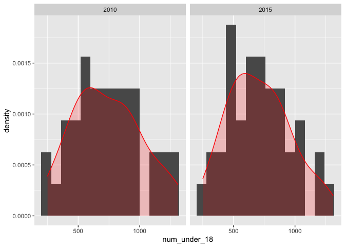
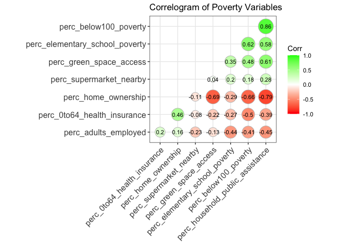
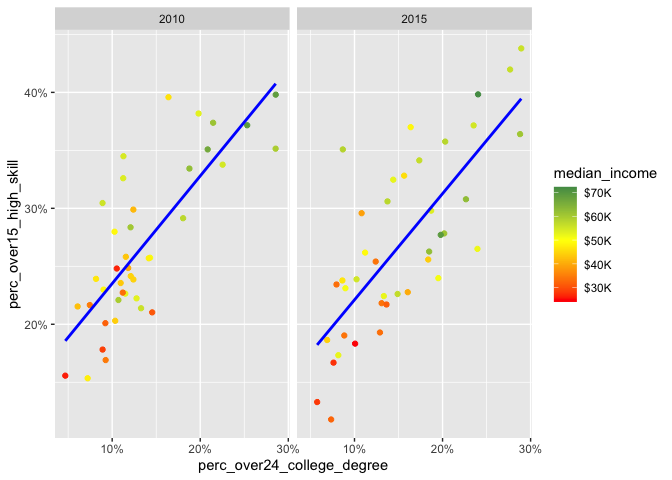

Data Exploration for Pottsville, PA
================

\#Necessary Libraries

``` r
library(tidyverse)
```

    ## ── Attaching packages ─────────────────────────────────────── tidyverse 1.3.0 ──

    ## ✓ ggplot2 3.3.2     ✓ purrr   0.3.4
    ## ✓ tibble  3.0.4     ✓ dplyr   1.0.2
    ## ✓ tidyr   1.1.1     ✓ stringr 1.4.0
    ## ✓ readr   1.3.1     ✓ forcats 0.5.0

    ## ── Conflicts ────────────────────────────────────────── tidyverse_conflicts() ──
    ## x dplyr::filter() masks stats::filter()
    ## x dplyr::lag()    masks stats::lag()

# Import and Clean Data

``` r
pott <- read_csv('/Users/TyPainter1/Desktop/Masters/Fall\ 2020/DS-5610/eda20-team5-project/Data\ Basics/data.csv') %>% filter(msaname15 == 'Pottsville, PA Micro Area') # filter for Pottsville
```

# Adjust Column Names

Most of the columns are hard to understand tried to make it easier

``` r
pott <- pott %>% 
  mutate(ED_PRXECE_NM = exp(ED_PRXECE)) %>%
  mutate(ED_PRXHQECE_NM = exp(ED_PRXHQECE)) %>%
  mutate(HE_SUPRFND_NM = exp(HE_SUPRFND)) %>%
  mutate(HE_RSEI_NM = exp(HE_RSEI)) %>%
  select(-ED_PRXECE, -ED_PRXHQECE, -HE_SUPRFND, -HE_RSEI)
```

Most of the columns are hard to understand. We tried to make it easier
and obvious even without the data dictionary.

``` r
pott <- pott %>% 
  rename(id = `_id`) %>% 
  rename(geo_id = geoid) %>% 
  rename(metro_areas = in100) %>%
  rename(area_code = msaid15) %>% 
  rename(county_code = countyfips) %>%
  rename(num_under_18 = pop) %>% 
  rename(ratio_students_AP_enrolled = ED_APENR) %>%
  rename(perc_over24_college_degree = ED_ATTAIN) %>%
  rename(perc_18to24_nearby_college_enrolled = ED_COLLEGE) %>%
  rename(perc_3to4_school_enrolled = ED_ECENROL) %>%
  rename(perc_high_grad = ED_HSGRAD) %>%
  rename(score_third_grade_math = ED_MATH) %>%
  rename(score_third_grade_read = ED_READING) %>%
  rename(perc_elementary_school_poverty = ED_SCHPOV) %>% 
  rename(perc_teacher_1and2_years=ED_TEACHXP) %>% 
  rename(num_ECE_nearby = ED_PRXECE_NM) %>% 
  rename(num_high_qual_ECE_nearby = ED_PRXHQECE_NM) %>% 
  rename(perc_supermarket_nearby = HE_FOOD) %>% 
  rename(perc_green_space_access = HE_GREEN) %>%
  rename(days_temp_above90 = HE_HEAT) %>%
  rename(perc_0to64_health_insurance = HE_HLTHINS) %>%
  rename(mean_ozone_amount = HE_OZONE) %>%
  rename(mean_microparticle = HE_PM25) %>%
  rename(perc_housing_vacancy = HE_VACANCY) %>%
  rename(index_walkability = HE_WALK) %>% 
  rename(num_waste_dump_sites = HE_SUPRFND_NM) %>%
  rename(index_air_pollutants = HE_RSEI_NM) %>%
  rename(perc_below100_poverty = SE_POVRATE) %>%
  rename(perc_household_public_assistance = SE_PUBLIC) %>%
  rename(perc_home_ownership = SE_HOME) %>%
  rename(perc_over15_high_skill = SE_OCC) %>%
  rename(median_income=SE_MHE) %>%
  rename(perc_adults_employed = SE_EMPRAT) %>%
  rename(perc_worker_commute_over1hour = SE_JOBPROX) %>%
  rename(perc_single_parent = SE_SINGLE)
```

\#\#Basic Exporlation

``` r
dim(pott)
```

    ## [1] 80 39

``` r
head(pott)
```

    ## # A tibble: 6 x 39
    ##       id geo_id  year metro_areas area_code msaname15 county_code statefips
    ##    <dbl> <chr>  <dbl>       <dbl>     <dbl> <chr>     <chr>       <chr>    
    ## 1 116325 42107…  2010           0     39060 Pottsvil… 42107       42       
    ## 2 116326 42107…  2015           0     39060 Pottsvil… 42107       42       
    ## 3 116327 42107…  2010           0     39060 Pottsvil… 42107       42       
    ## 4 116328 42107…  2015           0     39060 Pottsvil… 42107       42       
    ## 5 116329 42107…  2010           0     39060 Pottsvil… 42107       42       
    ## 6 116330 42107…  2015           0     39060 Pottsvil… 42107       42       
    ## # … with 31 more variables: stateusps <chr>, num_under_18 <dbl>,
    ## #   ratio_students_AP_enrolled <dbl>, perc_over24_college_degree <dbl>,
    ## #   perc_18to24_nearby_college_enrolled <dbl>, perc_3to4_school_enrolled <dbl>,
    ## #   perc_high_grad <dbl>, score_third_grade_math <dbl>,
    ## #   score_third_grade_read <dbl>, perc_elementary_school_poverty <dbl>,
    ## #   perc_teacher_1and2_years <dbl>, perc_supermarket_nearby <dbl>,
    ## #   perc_green_space_access <dbl>, days_temp_above90 <dbl>,
    ## #   perc_0to64_health_insurance <dbl>, mean_ozone_amount <dbl>,
    ## #   mean_microparticle <dbl>, perc_housing_vacancy <dbl>,
    ## #   index_walkability <dbl>, perc_below100_poverty <dbl>,
    ## #   perc_household_public_assistance <dbl>, perc_home_ownership <dbl>,
    ## #   perc_over15_high_skill <dbl>, median_income <dbl>,
    ## #   perc_adults_employed <dbl>, perc_worker_commute_over1hour <dbl>,
    ## #   perc_single_parent <dbl>, num_ECE_nearby <dbl>,
    ## #   num_high_qual_ECE_nearby <dbl>, num_waste_dump_sites <dbl>,
    ## #   index_air_pollutants <dbl>

``` r
summary(pott)
```

    ##        id            geo_id               year       metro_areas
    ##  Min.   :116325   Length:80          Min.   :2010   Min.   :0   
    ##  1st Qu.:116345   Class :character   1st Qu.:2010   1st Qu.:0   
    ##  Median :116364   Mode  :character   Median :2012   Median :0   
    ##  Mean   :116364                      Mean   :2012   Mean   :0   
    ##  3rd Qu.:116384                      3rd Qu.:2015   3rd Qu.:0   
    ##  Max.   :116404                      Max.   :2015   Max.   :0   
    ##                                                                 
    ##    area_code      msaname15         county_code         statefips        
    ##  Min.   :39060   Length:80          Length:80          Length:80         
    ##  1st Qu.:39060   Class :character   Class :character   Class :character  
    ##  Median :39060   Mode  :character   Mode  :character   Mode  :character  
    ##  Mean   :39060                                                           
    ##  3rd Qu.:39060                                                           
    ##  Max.   :39060                                                           
    ##                                                                          
    ##   stateusps          num_under_18    ratio_students_AP_enrolled
    ##  Length:80          Min.   : 251.0   Min.   :0.00000           
    ##  Class :character   1st Qu.: 523.0   1st Qu.:0.09962           
    ##  Mode  :character   Median : 696.5   Median :0.20241           
    ##                     Mean   : 723.6   Mean   :0.21289           
    ##                     3rd Qu.: 899.5   3rd Qu.:0.30776           
    ##                     Max.   :1310.0   Max.   :0.60760           
    ##                                                                
    ##  perc_over24_college_degree perc_18to24_nearby_college_enrolled
    ##  Min.   : 4.675             Min.   :20.30                      
    ##  1st Qu.: 9.867             1st Qu.:29.82                      
    ##  Median :12.588             Median :32.22                      
    ##  Mean   :14.358             Mean   :31.63                      
    ##  3rd Qu.:18.534             3rd Qu.:34.71                      
    ##  Max.   :28.936             Max.   :39.25                      
    ##                                                                
    ##  perc_3to4_school_enrolled perc_high_grad  score_third_grade_math
    ##  Min.   :  0.00            Min.   :71.20   Min.   :104.7         
    ##  1st Qu.: 26.70            1st Qu.:81.61   1st Qu.:182.5         
    ##  Median : 43.90            Median :85.67   Median :224.9         
    ##  Mean   : 42.72            Mean   :85.13   Mean   :209.2         
    ##  3rd Qu.: 58.40            3rd Qu.:88.67   3rd Qu.:237.5         
    ##  Max.   :100.00            Max.   :95.68   Max.   :270.8         
    ##  NA's   :1                                                       
    ##  score_third_grade_read perc_elementary_school_poverty perc_teacher_1and2_years
    ##  Min.   :140.2          Min.   : 20.61                 Min.   : 0.2677         
    ##  1st Qu.:187.4          1st Qu.: 40.47                 1st Qu.: 6.5354         
    ##  Median :204.5          Median : 51.17                 Median : 9.0578         
    ##  Mean   :200.0          Mean   : 52.15                 Mean   : 8.7679         
    ##  3rd Qu.:216.7          3rd Qu.: 60.11                 3rd Qu.:10.6624         
    ##  Max.   :251.6          Max.   :100.00                 Max.   :17.4985         
    ##                                                                                
    ##  perc_supermarket_nearby perc_green_space_access days_temp_above90
    ##  Min.   : 0.7896         Min.   : 0.700          Min.   :0.000    
    ##  1st Qu.: 2.3515         1st Qu.: 1.475          1st Qu.:1.333    
    ##  Median : 4.0586         Median : 4.850          Median :3.000    
    ##  Mean   : 5.0370         Mean   :13.615          Mean   :3.854    
    ##  3rd Qu.: 6.5800         3rd Qu.:24.450          3rd Qu.:6.667    
    ##  Max.   :16.7561         Max.   :53.100          Max.   :9.000    
    ##                                                                   
    ##  perc_0to64_health_insurance mean_ozone_amount mean_microparticle
    ##  Min.   :60.18               Min.   :37.82     Min.   : 8.514    
    ##  1st Qu.:87.37               1st Qu.:38.54     1st Qu.: 9.087    
    ##  Median :90.40               Median :40.27     Median : 9.788    
    ##  Mean   :89.69               Mean   :40.14     Mean   : 9.802    
    ##  3rd Qu.:92.62               3rd Qu.:41.83     3rd Qu.:10.574    
    ##  Max.   :96.81               Max.   :42.03     Max.   :11.254    
    ##                                                                  
    ##  perc_housing_vacancy index_walkability perc_below100_poverty
    ##  Min.   : 1.356       Min.   : 2.825    Min.   : 1.006       
    ##  1st Qu.: 6.931       1st Qu.: 5.549    1st Qu.: 7.155       
    ##  Median :10.589       Median : 7.396    Median :10.678       
    ##  Mean   :12.091       Mean   : 7.415    Mean   :13.019       
    ##  3rd Qu.:15.889       3rd Qu.: 9.680    3rd Qu.:15.938       
    ##  Max.   :36.028       Max.   :11.572    Max.   :43.898       
    ##                                                              
    ##  perc_household_public_assistance perc_home_ownership perc_over15_high_skill
    ##  Min.   : 2.695                   Min.   :46.50       Min.   :11.79         
    ##  1st Qu.: 8.082                   1st Qu.:64.36       1st Qu.:22.02         
    ##  Median :11.735                   Median :76.84       Median :25.50         
    ##  Mean   :14.689                   Mean   :74.54       Mean   :26.82         
    ##  3rd Qu.:21.294                   3rd Qu.:84.34       3rd Qu.:32.65         
    ##  Max.   :38.076                   Max.   :93.67       Max.   :43.79         
    ##                                                                             
    ##  median_income   perc_adults_employed perc_worker_commute_over1hour
    ##  Min.   :24073   Min.   :16.06        Min.   : 0.7799              
    ##  1st Qu.:39958   1st Qu.:71.98        1st Qu.: 7.5122              
    ##  Median :49904   Median :78.82        Median : 9.5635              
    ##  Mean   :48160   Mean   :74.64        Mean   : 9.5951              
    ##  3rd Qu.:56355   3rd Qu.:82.47        3rd Qu.:11.5070              
    ##  Max.   :72289   Max.   :90.91        Max.   :18.9684              
    ##                                                                    
    ##  perc_single_parent num_ECE_nearby   num_high_qual_ECE_nearby
    ##  Min.   :12.54      Min.   : 1.681   Min.   :1e-06           
    ##  1st Qu.:24.83      1st Qu.: 3.245   1st Qu.:1e-06           
    ##  Median :33.27      Median : 5.616   Median :1e-06           
    ##  Mean   :34.70      Mean   : 7.455   Mean   :1e-06           
    ##  3rd Qu.:43.64      3rd Qu.:10.619   3rd Qu.:1e-06           
    ##  Max.   :67.10      Max.   :19.137   Max.   :1e-06           
    ##                                                              
    ##  num_waste_dump_sites index_air_pollutants
    ##  Min.   :1e-06        Min.   :  394.3     
    ##  1st Qu.:1e-06        1st Qu.:  979.2     
    ##  Median :1e-06        Median : 2022.5     
    ##  Mean   :1e-06        Mean   : 2634.2     
    ##  3rd Qu.:1e-06        3rd Qu.: 3281.8     
    ##  Max.   :1e-06        Max.   :12431.1     
    ## 

``` r
pott %>% # find amount of NAs
  select_if(function(x) any(is.na(x))) %>% 
  summarise_each(funs(sum(is.na(.))))
```

    ## # A tibble: 1 x 1
    ##   perc_3to4_school_enrolled
    ##                       <int>
    ## 1                         1

``` r
library(ggplot2)

ggplot(pott, aes(x = num_under_18,)) +
  geom_histogram(aes(y=..density..), binwidth=80) +
  geom_density(col = "red", alpha =.2, fill = "red") +
  facet_wrap(~year)
```

<!-- -->

``` r
pott2 <- pott %>% select(perc_elementary_school_poverty, perc_supermarket_nearby, perc_green_space_access, perc_0to64_health_insurance, perc_below100_poverty, perc_household_public_assistance, perc_home_ownership, perc_adults_employed)

library(ggcorrplot)
ggcorrplot(round(cor(pott2), 2), hc.order = TRUE, # find correlation between poverty variables
           type = "lower", 
           lab = TRUE, 
           lab_size = 3, 
           method="circle", 
           colors = c("red", "white", "green"), 
           title="Correlogram of Poverty Variables", 
           ggtheme=theme_bw)
```

<!-- -->

``` r
ggplot(pott) +
  geom_point(aes(x = perc_over24_college_degree, y = perc_over15_high_skill, col = median_income)) +
  scale_color_gradient2(low="red1", mid = "yellow1", high="seagreen", midpoint = median(pott$median_income), breaks = c(30000,40000,50000,60000,70000), labels = c("$30K","$40K", "$50K", "$60K", "$70K")) +
  geom_smooth(aes(x = perc_over24_college_degree, y = perc_over15_high_skill), col = "blue", se = FALSE, method = "lm") +
  scale_x_continuous(labels = function(x){paste0(x, "%")}) +
  scale_y_continuous(labels = function(x){paste0(x, "%")}) +
  facet_wrap(~year)
```

    ## `geom_smooth()` using formula 'y ~ x'

<!-- -->

``` r
ggplot(pott) +
  geom_point(aes(y = perc_over24_college_degree, x = perc_over15_high_skill, col = median_income)) +
  scale_color_gradient2(low="red1", mid = "yellow1", high="seagreen", midpoint = median(pott$median_income), breaks = c(30000,40000,50000,60000,70000), labels = c("$30K","$40K", "$50K", "$60K", "$70K")) +
  geom_smooth(aes(y = perc_over24_college_degree, x = perc_over15_high_skill), col = "blue", se = FALSE, method = "lm") +
  scale_x_continuous(labels = function(x){paste0(x, "%")}) +
  scale_y_continuous(labels = function(x){paste0(x, "%")}) +
  facet_wrap(~year)
```

    ## `geom_smooth()` using formula 'y ~ x'

<!-- -->

``` r
pott%>%
  group_by(msaname15)%>%
  filter(year=='2015')%>%
  summarise(city_under_18_pop = sum(num_under_18))%>%
  arrange(desc(city_under_18_pop))%>%
  na.omit(msaname15)
```

    ## `summarise()` ungrouping output (override with `.groups` argument)

    ## # A tibble: 1 x 2
    ##   msaname15                 city_under_18_pop
    ##   <chr>                                 <dbl>
    ## 1 Pottsville, PA Micro Area             28336
