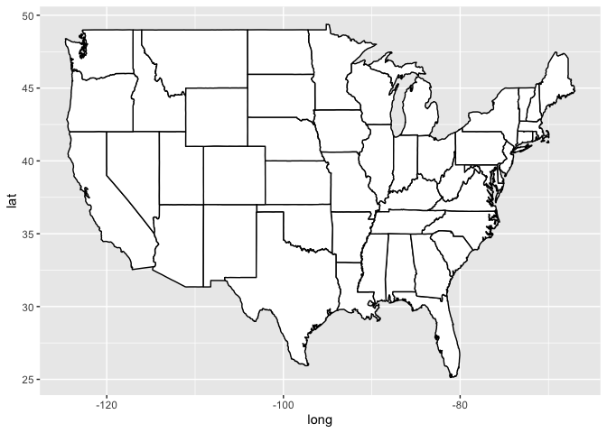
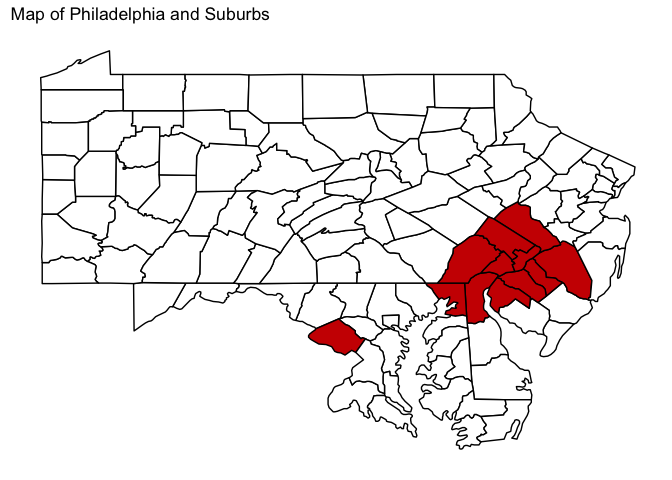

Introduction Maps
================

# Setup Data

``` r
library(tidyverse)
```

    ## ── Attaching packages ─────────────────────────────────────── tidyverse 1.3.0 ──

    ## ✓ ggplot2 3.3.2     ✓ purrr   0.3.4
    ## ✓ tibble  3.0.4     ✓ dplyr   1.0.2
    ## ✓ tidyr   1.1.1     ✓ stringr 1.4.0
    ## ✓ readr   1.3.1     ✓ forcats 0.5.0

    ## ── Conflicts ────────────────────────────────────────── tidyverse_conflicts() ──
    ## x dplyr::filter() masks stats::filter()
    ## x dplyr::lag()    masks stats::lag()

``` r
library(ggplot2)
library(maps)
```

    ## 
    ## Attaching package: 'maps'

    ## The following object is masked from 'package:purrr':
    ## 
    ##     map

``` r
library(readxl)
library(janitor)
```

    ## 
    ## Attaching package: 'janitor'

    ## The following objects are masked from 'package:stats':
    ## 
    ##     chisq.test, fisher.test

``` r
us_states <- map_data("state")

states <- clean_names(read_excel("/Users/TyPainter1/Desktop/Masters/Fall\ 2020/DS-5610/eda20-team5-project/Ty-Work/intro-maps/states.xlsx"))
usa <- ggplot(data = us_states,
            mapping = aes(x = long, y = lat,
                          group = group))+
  geom_polygon(fill = "white", color = "black")
usa
```

<!-- -->

``` r
states$name <- tolower(states$name)
us_states <- left_join(us_states, states, by = c("region" = "name"))
#new_df <- left_join(us_states, df, by = c("postal_code"="stateusps"))
```

# USA

``` r
us_states %>% mutate(state_used = ifelse(postal_code %in% c("PA", "CA", "TX", "NY"), "Yes", "No")) %>% 
  ggplot(mapping = aes(x = long, 
                       y = lat, 
                       group = group, 
                       fill = state_used)
         ) +
  geom_polygon(color = "black") +
  scale_fill_manual(values = c("white","red3")) +
  theme(legend.position = "none",
        panel.grid = element_blank(),
        axis.title = element_blank(),
        axis.text = element_blank(),
        axis.ticks = element_blank(),
        panel.background = element_blank()) +
  labs(title = "Map of the United States of America")
```

<!-- -->

# Philadelphia and Suburbs

``` r
us_counties <- map_data("county")

us_counties %>% filter(region %in% c("pennsylvania", "delaware", "maryland", "new jersey")) %>%
  mutate(county_used = ifelse(subregion %in% c("new castle", "cecil", "burlington", "camden", "gloucester", "salem", "bucks", "chester", "delaware", "montgomery", "philadelphia"), "y", "n")) %>% 
  ggplot(mapping = aes(x = long, 
                       y = lat, 
                       group = group, fill = county_used)
         ) +
  geom_polygon(color = "black") +
  scale_fill_manual(values = c("white","red3"))  +
  theme(legend.position = "none",
        panel.grid = element_blank(),
        axis.title = element_blank(),
        axis.text = element_blank(),
        axis.ticks = element_blank(),
        panel.background = element_blank()) +
  labs(title = "Map of Philadelphia and Suburbs")
```

<!-- -->
