Nov 29 meeting
================
Soyeon Park
11/30/2020

# Necessary Libraries

``` r
library(tidyverse)
```

    ## ── Attaching packages ─────────────────────────────────────── tidyverse 1.3.0 ──

    ## ✓ ggplot2 3.3.2     ✓ purrr   0.3.4
    ## ✓ tibble  3.0.4     ✓ dplyr   1.0.2
    ## ✓ tidyr   1.1.2     ✓ stringr 1.4.0
    ## ✓ readr   1.3.1     ✓ forcats 0.5.0

    ## ── Conflicts ────────────────────────────────────────── tidyverse_conflicts() ──
    ## x dplyr::filter() masks stats::filter()
    ## x dplyr::lag()    masks stats::lag()

``` r
library(ggplot2)
library(gganimate)
library(maps)
```

    ## 
    ## Attaching package: 'maps'

    ## The following object is masked from 'package:purrr':
    ## 
    ##     map

``` r
library(dplyr, warn.conflicts = FALSE)
options(dplyr.summarise.inform = FALSE)
```

## Basic importating

``` r
# Import data
df <- read_csv('../../Data Basics/data.csv')
```

# Data Cleaning

## Column names

According to the data dictionary, the unit of the 4
columns(“ED\_PRXECE”, “ED\_PRXHQECE”, “HE\_SUPRFND”, “HE\_RSEI”) in
the data is natural log. Natural log units change values less than
e(2.71828) into negative numbers and this makes analysis difficult.
Therefore, we are going to change the value of these 4 columns into
original unit by using exp function.

``` r
df <- df %>% 
  mutate(ED_PRXECE_NM = exp(ED_PRXECE)) %>%
  mutate(ED_PRXHQECE_NM = exp(ED_PRXHQECE)) %>%
  mutate(HE_SUPRFND_NM = exp(HE_SUPRFND)) %>%
  mutate(HE_RSEI_NM = exp(HE_RSEI)) %>%
  select(-ED_PRXECE, -ED_PRXHQECE, -HE_SUPRFND, -HE_RSEI)
```

Most of the columns are hard to understand. We tried to make it easier
and obvious even without the data dictionary.

``` r
df <- df %>% 
  rename(id = `_id`) %>% 
  rename(geo_id = geoid) %>% 
  rename(metro_areas = in100) %>%
  rename(area_code = msaid15) %>% 
  rename(county_code = countyfips) %>%
  rename(num_under_18 = pop) %>% 
  rename(ratio_students_AP_enrolled = ED_APENR) %>%
  rename(perc_over24_college_degree = ED_ATTAIN) %>%
  rename(perc_18to24_nearby_college_enrolled = ED_COLLEGE) %>%
  rename(perc_3to4_school_enrolled = ED_ECENROL) %>%
  rename(perc_high_grad = ED_HSGRAD) %>%
  rename(score_third_grade_math = ED_MATH) %>%
  rename(score_third_grade_read = ED_READING) %>%
  rename(perc_elementary_school_poverty = ED_SCHPOV) %>% 
  rename(perc_teacher_1and2_years=ED_TEACHXP) %>% 
  rename(num_ECE_nearby = ED_PRXECE_NM) %>% 
  rename(num_high_qual_ECE_nearby = ED_PRXHQECE_NM) %>% 
  rename(perc_supermarket_nearby = HE_FOOD) %>% 
  rename(perc_green_space_access = HE_GREEN) %>%
  rename(days_temp_above90 = HE_HEAT) %>%
  rename(perc_0to64_health_insurance = HE_HLTHINS) %>%
  rename(mean_ozone_amount = HE_OZONE) %>%
  rename(mean_microparticle = HE_PM25) %>%
  rename(perc_housing_vacancy = HE_VACANCY) %>%
  rename(index_walkability = HE_WALK) %>% 
  rename(num_waste_dump_sites = HE_SUPRFND_NM) %>%
  rename(index_air_pollutants = HE_RSEI_NM) %>%
  rename(perc_below100_poverty = SE_POVRATE) %>%
  rename(perc_household_public_assistance = SE_PUBLIC) %>%
  rename(perc_home_ownership = SE_HOME) %>%
  rename(perc_over15_high_skill = SE_OCC) %>%
  rename(median_income=SE_MHE) %>%
  rename(perc_adults_employed = SE_EMPRAT) %>%
  rename(perc_worker_commute_over1hour = SE_JOBPROX) %>%
  rename(perc_single_parent = SE_SINGLE)
```

``` r
df_2015 <- df %>% filter(year == 2015)
df_2010 <- df %>% filter(year == 2010)
```

``` r
df_2015_3rd <- df_2015 %>% mutate(score_third_grade = score_third_grade_math + score_third_grade_read) %>% 
  group_by(stateusps) %>% 
  summarise(third_grade = mean(score_third_grade, na.rm = TRUE))

df_2010_3rd <- df_2010 %>% mutate(score_third_grade = score_third_grade_math + score_third_grade_read) %>% 
  group_by(stateusps) %>% 
  summarise(third_grade = mean(score_third_grade, na.rm = TRUE))
```

Deleted unnecessary columns (They have the same values.)

1)  Texas

<!-- end list -->

``` r
df_tx <- df %>% filter((county_code == "48201") | (county_code == "48157")| (county_code == "48339")|(county_code == "48291")|(county_code == "48473"))
```

``` r
df_tx <- df_tx %>% mutate(county_name = case_when(county_code == "48201" ~ "Harris", county_code == "48157" ~ "Fort Bend", county_code == "48339" ~ "Montgomery", county_code == "48291" ~ "Liberty", county_code == "48473" ~ "Waller"))
```

``` r
df_tx <- df_tx %>% mutate(group = ifelse(county_code == "48201", "city", "suburb")) %>%
  select(group, everything())
```

``` r
df_tx$county_name = factor(df_tx$county_name, levels = c("Harris", "Fort Bend", "Montgomery", "Waller", "Liberty"))
```

2)  Philadelphia

<!-- end list -->

``` r
df_pa <- df %>% filter((county_code == "42017")|(county_code == "42029")|(county_code == "42045")|(county_code == "42091")|(county_code == "42101"))
```

``` r
df_pa <- df_pa %>% mutate(county_name = case_when(county_code == "42017" ~ "Bucks", county_code == "42029" ~ "Chester", county_code == "42045" ~ "Delaware", county_code == "42091" ~ "Montgomery", county_code == "42101" ~ "Philadelphia"))
```

``` r
df_pa <- df_pa %>% mutate(group = ifelse(county_code == "42101", "city", "suburb")) %>%
  select(group, everything())
```

``` r
df_pa$county_name = factor(df_pa$county_name, levels = c("Philadelphia", "Bucks", "Chester", "Delaware", "Montgomery"))
```

3)  NY

<!-- end list -->

``` r
df_nyc <- df %>% filter((county_code == "36061") | (county_code == "36047")| (county_code == "36081")|(county_code == "36005")|(county_code == "36085"))
```

``` r
df_nyc <- df_nyc %>% mutate(county_name = case_when(county_code == "36061" ~ "Manhattan", county_code == "36047" ~ "Brooklyn", county_code == "36081" ~ "Queens", county_code == "36005" ~ "Bronx", county_code == "36085" ~ "Staten Island"))
```

``` r
df_nyc <- df_nyc %>% mutate(group = ifelse(county_code == "36061", "city", "suburb")) %>%
  select(group, everything())
```

``` r
df_nyc$county_name = factor(df_nyc$county_name, levels = c("Manhattan", "Bronx", "Brooklyn", "Queens", "Staten Island"))
```

4)  CA

<!-- end list -->

``` r
df_ca <- df %>% filter((county_code == "06111") | (county_code == "06059")| (county_code == "06029")|(county_code == "06071")|(county_code == "06037"))
```

``` r
df_ca <- df_ca %>% 
  mutate(county_name = case_when(county_code == "06111" ~ "Ventura", 
                                county_code == "06059" ~ "Orange", 
                                county_code == "06029" ~ "Kern", 
                                county_code == "06071" ~ "San Bernardino", 
                                county_code == "06037" ~ "Los Angeles"))
```

``` r
df_ca <- df_ca %>% mutate(group = ifelse(county_code == "06037", "city", "suburb")) %>%
  select(group, everything())
```

``` r
df_ca$county_name = factor(df_ca$county_name, levels = c("Los Angeles", "Ventura", "Orange", "Kern",  "San Bernardino"))
```

``` r
df_tx_2010 <- df_tx %>% filter(year == "2010")
df_tx_2015 <- df_tx %>% filter(year == "2015")
```

``` r
df_pa_2010 <- df_pa %>% filter(year == "2010")
df_pa_2015 <- df_pa %>% filter(year == "2015")
```

``` r
df_nyc_2010 <- df_nyc %>% filter(year == "2010")
df_nyc_2015 <- df_nyc %>% filter(year == "2015")
```

``` r
df_ca_2010 <- df_ca %>% filter(year == "2010")
df_ca_2015 <- df_ca %>% filter(year == "2015")
```

``` r
df_tx_2015 %>% 
  mutate(Area = ifelse(county_name == "Harris", "City", "Suburb")) %>% 
  ggplot(aes(x = county_name, y = score_third_grade_math + score_third_grade_read, fill = Area, alpha = Area)) +
  geom_boxplot() +
  geom_hline(data = df_2015, aes(yintercept = mean(score_third_grade_read, na.rm = TRUE) + mean(score_third_grade_math, na.rm = TRUE)), col = "red",linetype='dotted') + 
  scale_fill_manual(values = c("#69b3a2", "grey")) +
  scale_alpha_manual(values=c(1,0.1)) +
  theme_classic() +
  labs(title = "2015 Houston 3rd Grades Read and Math scores by County", subtitle = "The red lines show U.S nation's average", x = "County", y = "3rd Grades Reading & Math score")
```

<!-- -->

``` r
df_pa_2015 %>% 
  mutate(Area = ifelse(county_name == "Philadelphia", "City", "Suburb")) %>% 
  ggplot(aes(x = county_name, y = score_third_grade_math + score_third_grade_read, fill = Area, alpha = Area)) +
  geom_boxplot(outlier.shape = NA) +
  geom_hline(data = df_2015, aes(yintercept = mean(score_third_grade_read, na.rm = TRUE) + mean(score_third_grade_math, na.rm = TRUE)), col = "red",linetype='dotted') + 
  scale_fill_manual(values = c("#69b3a2", "grey")) +
  scale_alpha_manual(values=c(1,0.1)) +
  theme_classic() +
  labs(title = "2015 Philadelphia 3rd Grades Read and Math scores by County", subtitle = "The red lines show U.S nation's average", x = "County", y = "3rd Grades Reading & Math score")
```

    ## Warning: Removed 8 rows containing non-finite values (stat_boxplot).

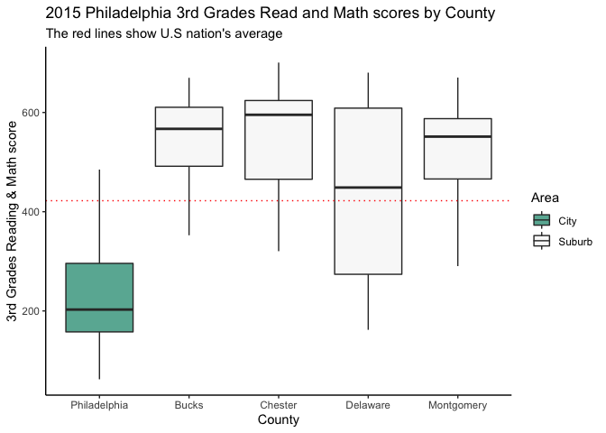<!-- -->

``` r
df_ca_2015 %>% 
  mutate(Area = ifelse(county_name == "Los Angeles", "City", "Suburb")) %>% 
  ggplot(aes(x = county_name, y = score_third_grade_math + score_third_grade_read, fill = Area, alpha = Area)) +
  geom_boxplot(outlier.shape = NA) +
  geom_hline(data = df_2015, aes(yintercept = mean(score_third_grade_read, na.rm = TRUE) + mean(score_third_grade_math, na.rm = TRUE)), col = "red",linetype='dotted') + 
  scale_fill_manual(values = c("#69b3a2", "grey")) +
  scale_alpha_manual(values=c(1,0.1)) +
  theme_classic() +
  labs(title = "2015 Los Angeles 3rd Grades Read and Math scores by County", subtitle = "The red lines show U.S nation's average", x = "County", y = "3rd Grades Reading & Math score")
```

    ## Warning: Removed 28 rows containing non-finite values (stat_boxplot).

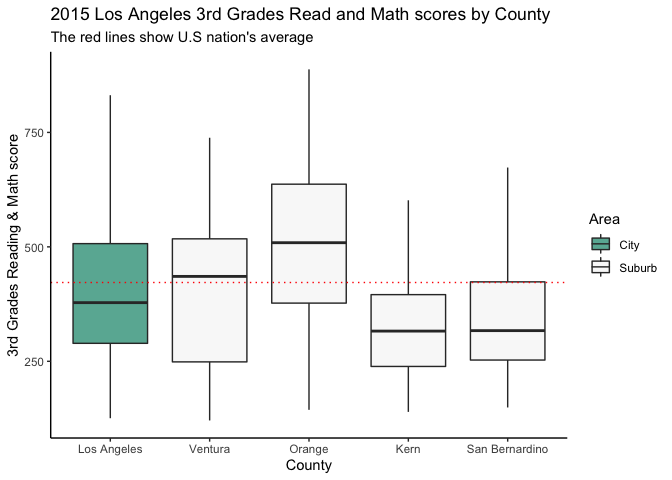<!-- -->

``` r
df_nyc_2015 %>% 
  mutate(Area = ifelse(county_name == "Manhattan", "City", "Suburb")) %>% 
  ggplot(aes(x = county_name, y = score_third_grade_math + score_third_grade_read, fill = Area, alpha = Area)) +
  geom_boxplot(outlier.shape = NA) +
  geom_hline(data = df_2015, aes(yintercept = mean(score_third_grade_read, na.rm = TRUE) + mean(score_third_grade_math, na.rm = TRUE)), col = "red",linetype='dotted') + 
  scale_fill_manual(values = c("#69b3a2", "grey")) +
  scale_alpha_manual(values=c(1,0.1)) +
  theme_classic() +
  labs(title = "2015 New York City 3rd Grades Read and Math scores by County", subtitle = "The red lines show U.S nation's average", x = "County", y = "3rd Grades Reading & Math score")
```

    ## Warning: Removed 38 rows containing non-finite values (stat_boxplot).

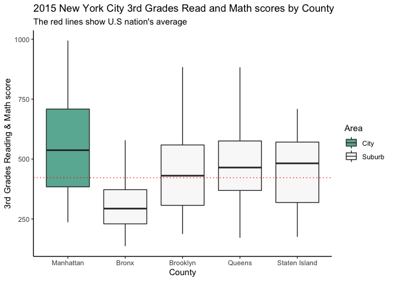<!-- -->

``` r
ggplot(df_tx_2015, aes(x = score_third_grade_math, y = score_third_grade_read, col = county_name)) + 
  geom_point() +
  facet_wrap(~group, nrow = 1) +
  geom_hline(data = df_2015, aes(yintercept = mean(score_third_grade_read, na.rm = TRUE)), col = "#2F4F4F", lwd = .3) + 
  geom_vline(data = df_2015, aes(xintercept = mean(score_third_grade_math, na.rm = TRUE)), col = "#2F4F4F", lwd = .3) +
  theme_bw() + 
  geom_text(mapping = aes(x = mean(score_third_grade_math, na.rm = TRUE), y = 120, label = 219.91), size = 3, colour = "black", angle = 90) +
  geom_text(mapping = aes(x = 150, y = mean(score_third_grade_read, na.rm = TRUE) + 10, label = 202.22), size = 3, colour = "black") +
  labs(title = "Houston 2015 3rd Grades Read and Math grades by County", subtitle = "The gray lines show U.S nation's average", x = "3rd Grades' Math Score", y = "3rd Grades' Read Score") +
  scale_color_discrete("County Names")
```

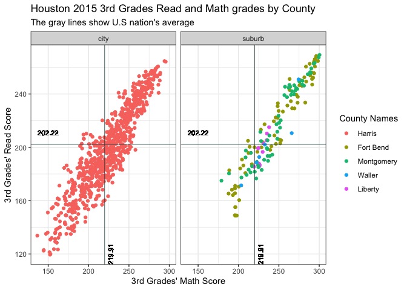<!-- -->

``` r
ggplot(df_pa_2015, aes(x = score_third_grade_math, y = score_third_grade_read, col = county_name)) + 
  geom_point() +
  facet_wrap(~group, nrow = 1) +
  geom_hline(data = df_2015, aes(yintercept = mean(score_third_grade_read, na.rm = TRUE)), col = "#2F4F4F", lwd = .3) + 
  geom_vline(data = df_2015, aes(xintercept = mean(score_third_grade_math, na.rm = TRUE)), col = "#2F4F4F", lwd = .3) +
  geom_text(mapping = aes(x = mean(score_third_grade_math, na.rm = TRUE), y = 80, label = 219.91), size = 3, colour = "black", angle = 90) +
  geom_text(mapping = aes(x = 50, y = mean(score_third_grade_read, na.rm = TRUE) + 10, label = 202.22), size = 3, colour = "black") +
  theme_bw() + 
  labs(title = "Philadelphia 2015 3rd Grades Read and Math grades by County", subtitle = "The red lines show U.S nation's average", x = "3rd Grades' Math Score", y = "3rd Grades' Read Score")+
  scale_color_discrete("County Names")
```

    ## Warning: Removed 8 rows containing missing values (geom_point).

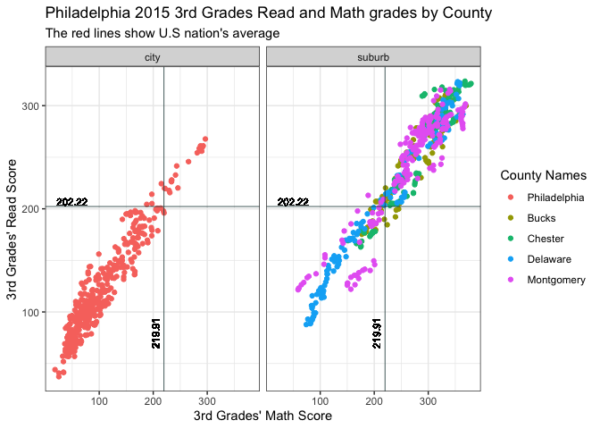<!-- -->

``` r
ggplot(df_nyc_2015, aes(x = score_third_grade_math, y = score_third_grade_read, col = county_name)) + 
  geom_point() +
  facet_wrap(~group, nrow = 1) +
  geom_hline(data = df_2015, aes(yintercept = mean(score_third_grade_read, na.rm = TRUE)), col = "red", lwd = .3) + 
  geom_vline(data = df_2015, aes(xintercept = mean(score_third_grade_math, na.rm = TRUE)), col = "red", lwd = .3) +
  geom_text(mapping = aes(x = mean(score_third_grade_math, na.rm = TRUE), y = 100, label = 219.91), size = 3, colour = "black", angle = 90) +
  geom_text(mapping = aes(x = 100, y = mean(score_third_grade_read, na.rm = TRUE) + 10, label = 202.22), size = 3, colour = "black") +
  theme_bw() + 
  labs(title = "New York City 2015 3rd Grades Read and Math grades by County", subtitle = "The red lines show U.S nation's average", x = "3rd Grades' Math Score", y = "3rd Grades' Read Score") +
  scale_color_discrete("County Names")
```

    ## Warning: Removed 38 rows containing missing values (geom_point).

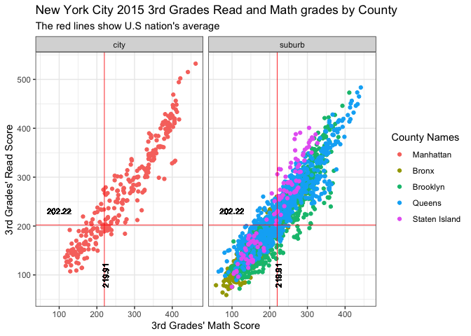<!-- -->

``` r
ggplot(df_ca_2010, aes(x = score_third_grade_math, y = score_third_grade_read, col = county_name)) +
  geom_point() +
  facet_wrap(~group, nrow = 1) +
  geom_hline(data = df_2010, aes(yintercept = mean(score_third_grade_read, na.rm = TRUE)), col = "red", lwd = .3) + 
  geom_vline(data = df_2010, aes(xintercept = mean(score_third_grade_math, na.rm = TRUE)), col = "red", lwd = .3) +
  geom_text(mapping = aes(x = mean(score_third_grade_math, na.rm = TRUE), y = 100, label = 219.91), size = 3, colour = "black", angle = 90) +
  geom_text(mapping = aes(x = 100, y = mean(score_third_grade_read, na.rm = TRUE) + 10, label = 202.22), size = 3, colour = "black") +
  theme_bw() + 
  labs(title = "LA City 2010 3rd Grades Read and Math grades by County", subtitle = "The red lines show U.S nation's average", x = "3rd Grades' Math Score", y = "3rd Grades' Read Score") +
  scale_color_discrete("County Names") 
```

    ## Warning: Removed 28 rows containing missing values (geom_point).

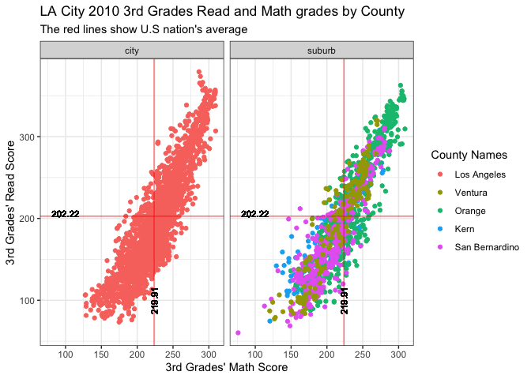<!-- -->

``` r
df_tx_2015_resi <- df_tx_2015 %>% filter(!is.na(perc_supermarket_nearby)) %>%
  filter(!is.na(perc_green_space_access)) %>%
  filter(!is.na(index_walkability)) %>%
  mutate(residential_environment = scale(perc_supermarket_nearby) + scale(perc_green_space_access) + scale(index_walkability)) %>%
  group_by(county_name) %>%
  summarise(resi_mean = mean(residential_environment))

ggplot(df_tx_2015_resi, aes(x = reorder(county_name, resi_mean, desc), y = resi_mean, fill=factor(ifelse(county_name=="Harris","Highlighted","Normal")))) +
  geom_bar(stat = "identity") +
  scale_fill_manual(name = "area", values=c("red","grey50")) +
  theme_bw() + 
  labs(title = "2015 Houston Index of good residential environment by conuty", subtitle = "Residential environment = Near Supermarket + Green Space Access + Walkability", y = "Index of good residential environment", x = "County" ) +
  theme(axis.text.x = element_text(angle = 60, hjust = 1))
```

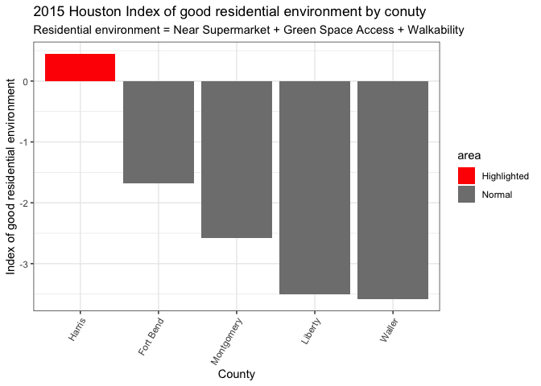<!-- -->

``` r
df_pa_2015_resi <- df_pa_2015 %>% filter(!is.na(perc_supermarket_nearby)) %>%
  filter(!is.na(perc_green_space_access)) %>%
  filter(!is.na(index_walkability)) %>%
  mutate(residential_environment = scale(perc_supermarket_nearby) + scale(perc_green_space_access) + scale(index_walkability)) %>%
  group_by(county_name) %>%
  summarise(resi_mean = mean(residential_environment))

ggplot(df_pa_2015_resi, aes(x = reorder(county_name, resi_mean, desc), y = resi_mean, fill=factor(ifelse(county_name=="Philadelphia","City","")))) +
  geom_bar(stat = "identity") +
  scale_fill_manual(name = "area", values=c("red","grey50")) +
  theme_bw() + 
  labs(title = "2015 Philadelphia Index of good residential environment by conuty", subtitle = "Residential environment = Near Supermarket + Green Space Access + Walkability", y = "Index of good residential environment", x = "County" )+
  theme(axis.text.x = element_text(angle = 60, hjust = 1))
```

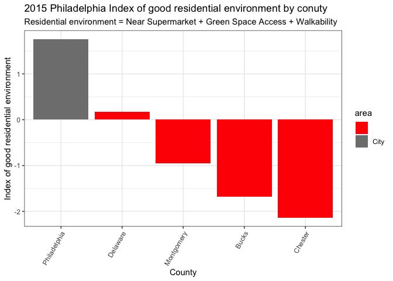<!-- -->

``` r
df_nyc_2015_resi <- df_nyc_2015 %>% filter(!is.na(perc_supermarket_nearby)) %>%
  filter(!is.na(perc_green_space_access)) %>%
  filter(!is.na(index_walkability)) %>%
  mutate(residential_environment = scale(perc_supermarket_nearby) + scale(perc_green_space_access) + scale(index_walkability)) %>%
  group_by(county_name) %>%
  summarise(resi_mean = mean(residential_environment))

ggplot(df_nyc_2015_resi, aes(x = reorder(county_name, resi_mean, desc), y = resi_mean, fill=factor(ifelse(county_name=="Manhattan","Highlighted","Normal")))) +
  geom_bar(stat = "identity") +
  scale_fill_manual(name = "area", values=c("red","grey50")) +
  theme_bw() + 
  labs(title = "2015 NYC Index of good residential environment by conuty", subtitle = "Residential environment = Near Supermarket + Green Space Access + Walkability", y = "Index of good residential environment", x = "County" )
```

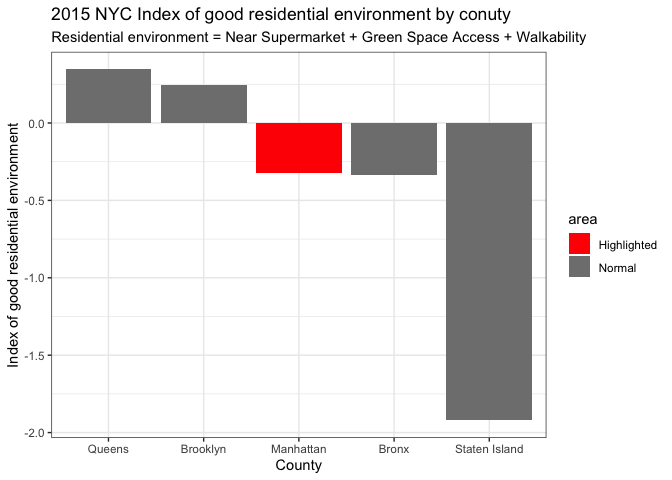<!-- -->

``` r
df_ca_2015_resi <- df_ca_2015 %>% filter(!is.na(perc_supermarket_nearby)) %>%
  filter(!is.na(perc_green_space_access)) %>%
  filter(!is.na(index_walkability)) %>%
  mutate(residential_environment = scale(perc_supermarket_nearby) + scale(perc_green_space_access) + scale(index_walkability)) %>%
  group_by(county_name) %>%
  summarise(resi_mean = mean(residential_environment))

ggplot(df_ca_2015_resi, aes(x = reorder(county_name, resi_mean, desc), y = resi_mean, fill=factor(ifelse(county_name=="Los Angeles","Highlighted","Normal")))) +
  geom_bar(stat = "identity") +
  theme_bw() +
  scale_fill_manual(name = "area", values=c("red","grey50")) +
  labs(title = "2015 LA Index of good residential environment by conuty", subtitle = "Residential environment = Near Supermarket + Green Space Access + Walkability", y = "Index of good residential environment", x = "County" )
```

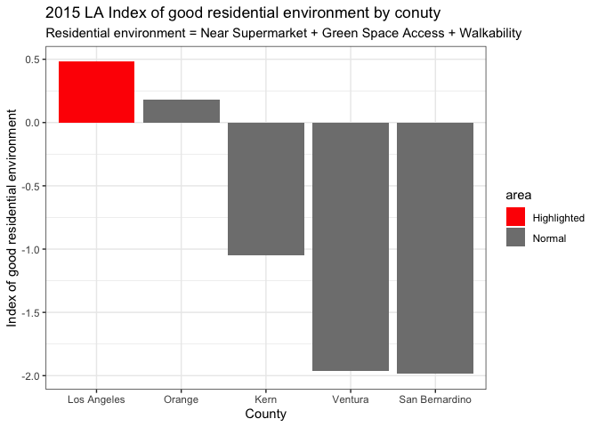<!-- -->
